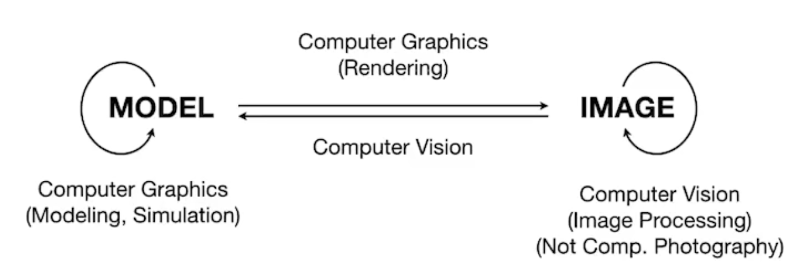

## 计算机图形学前导

Games 101 是一门讲解计算机图形学的公开课，由 **闫令琪** 老师传授。

图形学目前面临的挑战

- 光栅化

  将三维空间中的几何显示到屏幕上。

  - 实时要求在 1/30 或者 1/60 秒内渲染出一幅几何形体的画面，对时间要求极强。
  - 如果达不到实时要求，则称为离线，例如电影行业可以几分钟才渲染一副画面。
- 曲线和网格（几何）
- 光线追踪

  电影行业使用较多，游戏行业目前刚刚起步
- 动画系统和布料模拟

计算机图形学在游戏行业和影视行业的作用非常重要，游戏行业对以上的实时性要求非常高，需要投入大量的时间和精力去优化画面的生成速度。

## 计算机图形学和计算机视觉的区别

计算机视觉着重于 **预测**

计算机图形学着重于 **看**

## 图形学的依赖

### 基础数学

- 线性代数
- 向量
- 矩阵
- 微积分

### 基础物理

- 光学
- 物理

### 杂项

- 信号处理
- 走样/反走样
- 数值分析
- 解决复杂的数学计算
- 美感

## 向量

### 向量标量

### 点乘

向量的点乘可以认为是 向量A 在 向量B 上的标量投影，两个向量的点积：A·B 可以理解为向量A在向量B上的投影再乘B的长度。

### 叉乘

## 矩阵

- 平移
- 旋转
- 变换
