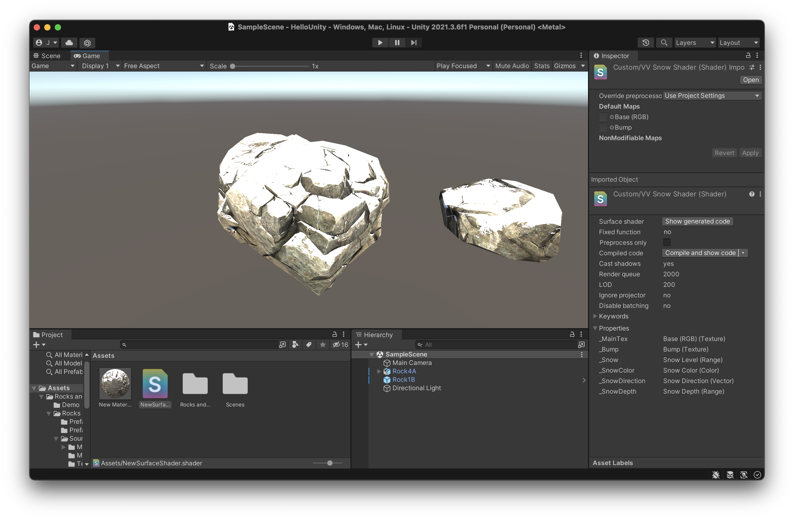

在我还在上高中的时候，我就开始学了一些 Unity，也尝试制作了一些简单的游戏，那时候更多是出于好玩，后来沉迷 Linux，就逐渐淡忘了游戏开发。

机缘巧合，我现在入手了一台 M1 mbp，接触到了 Apple 家的 Metal，又快速过了一下 Vulkan，也尝试做了一些入门级的项目，更幻想制作一个游戏引擎，所以最近有时间我就在看 Games104 的课程，补充一下相关知识，计划跟完 Games104，就去看一下闫令琪老师的 Games101，主攻一下计算机图形学。

有天中午我无意间看到了 onevcat 大佬写的一篇介绍 unity shader 的文章，并且还分享了一篇使用 shader 模拟物体表面的雪的效果，让我也想跟着做一个。



## Unity shader

Unity shader 并不像平常我们见的 OpenGL、Vulkan 和 Metal 的 shader 文件一样，Unity shader 更像是配置文件，它使用特定的结构语法保存各种信息，并和 Unity Editor 中其他对象交互。

一个基础的 Unity shader 的结构是这样的:

```shader
Shader "Custom/myshader" {
    Properties {}
    SubShader {}
    Fallback ""
}
```

可以看出，一个标准的 Unity shader 拥有四个部分，一个 Shader 的命名，一个属性对象，一个 SubShader 对象，一个 Fallback 字符串。

属性对象是 Unity Editor 和 shader 沟通的桥梁，我们可以在 Properties 中声明输入，从外部接受参数。

SubShader 对象是可以多个重复的，当第一个 SubShader 对象中的代码无法在当前的 GPU 中运行时，Unity 会切换到下一个 SubShader 对象。我们可以在同一份 Shader 文件中对不同的 GPU 实现不同的支持。

Fallback 字符串则是如果 SubShader 都无法运行时，采用的最终的渲染方法。

一个简单的理解就是，从上到下，画面效果是依次降低的。

## 自定义属性

## SubShader

```shader
SubShader {
    Tags {}
    Pass {
    }
}
```

```shader
Pass {
    CGPROGRAM
    ENDCG
}
```

## CGPROGRAM

// TODO：CGPROGRAM 是发送到 GPU 运行的程序，也是一般概念中的 shader。

## 自定义光照

## 法线

## Shader 代码

```shader
// Upgrade NOTE: replaced '_Object2World' with 'unity_ObjectToWorld'

Shader "Custom/SnowShader" {
    Properties {
        _MainTex ("Base (RGB)", 2D) = "white" {}
        _Bump ("Bump", 2D) = "bump" {}
        _Snow ("Snow Level", Range(0,1) ) = 0
        _SnowColor ("Snow Color", Color) = (1.0,1.0,1.0,1.0)
        _SnowDirection ("Snow Direction", Vector) = (0,1,0)
        _SnowDepth ("Snow Depth", Range(0,0.3)) = 0.1
    }
    SubShader {
        Tags { "RenderType"="Opaque" }
        LOD 200

        CGPROGRAM
        #pragma surface surf CustomDiffuse vertex:vert

        sampler2D _MainTex;
        sampler2D _Bump;
        float _Snow;
        float4 _SnowColor;
        float4 _SnowDirection;
        float _SnowDepth;

        struct Input {
            float2 uv_MainTex;
            float2 uv_Bump;
            float3 worldNormal;
            INTERNAL_DATA
        };

        inline float4 LightingCustomDiffuse (SurfaceOutput s, fixed3 lightDir, fixed atten) {
            float difLight = dot (s.Normal, lightDir);
            float hLambert = difLight * 0.5 + 0.5;
            float4 col;
            col.rgb = s.Albedo * _LightColor0.rgb * (hLambert * atten * 2);
            col.a = s.Alpha;
            return col;
        }

        void vert (inout appdata_full v) {
            float4 sn = mul(transpose(unity_ObjectToWorld) , _SnowDirection);
            if(dot(v.normal, sn.xyz) >= lerp(1,-1, (_Snow * 2) / 3)) {
                v.vertex.xyz += (sn.xyz + v.normal) * _SnowDepth * _Snow;
            }
        }

        void surf (Input IN, inout SurfaceOutput o) {
            half4 c = tex2D (_MainTex, IN.uv_MainTex);

            o.Normal = UnpackNormal(tex2D(_Bump, IN.uv_Bump));

            if (dot(WorldNormalVector(IN, o.Normal), _SnowDirection.xyz) > lerp(1,-1,_Snow)) {
                o.Albedo = _SnowColor.rgb;
            } else {
                o.Albedo = c.rgb;
            }

            o.Alpha = 1;
        }
        ENDCG
    }
    FallBack "Diffuse"
}
```

> **相关文章**
> [https://onevcat.com/2013/07/shader-tutorial-1/](https://onevcat.com/2013/07/shader-tutorial-1/)
