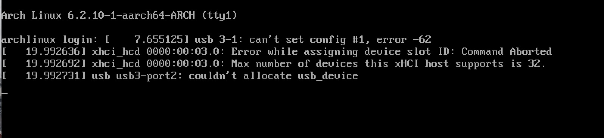

I am runing a linux virtual machine macos using parallels desktop. One day when I booted normally, I got a usb error and couldn't use the keyboard and mouse in virtual machine.

An error messages like this is output on the screen.

```shell
usb 3-1: can't set config #1, error -62
xhci_hcd Error while assigning device slot ID: Command Aborted.
xhci_hcd Max number of devices this xHCI host supports is 32.
usb usb3-port2: couldn't allocate usb_device
```



Finally I found a solution on the parallels desktop forum.

1. Start your virtual machine.
2. Press e to edit the grub menu during the boot phase, passing a new parameter to the kernel.
3. Append `xhci_hcd.quirks=0x40` after quiet
4. F10 booting the kernel
5. After entering the system, open the terminal and edit the `/etc/default/grub` file
6. Replace that line with the following line:

  > GRUB_CMDLINE_LINUX_DEFAULT="quiet xhci_hcd.quirks=0x40"

7. Next, execute the following command:

  > sudo update-grub
