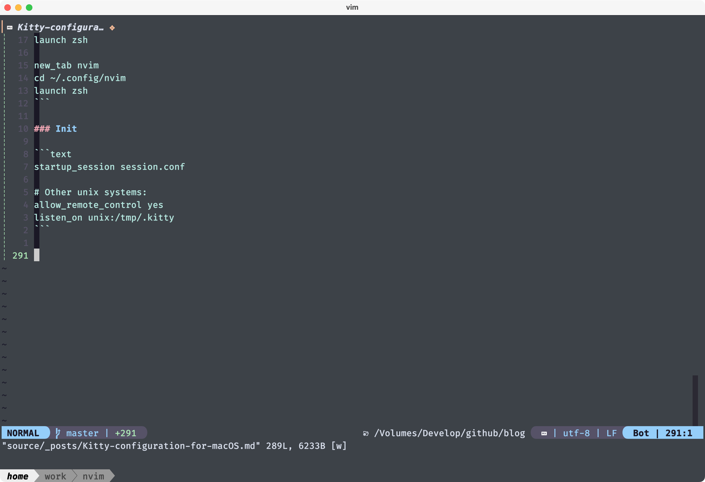
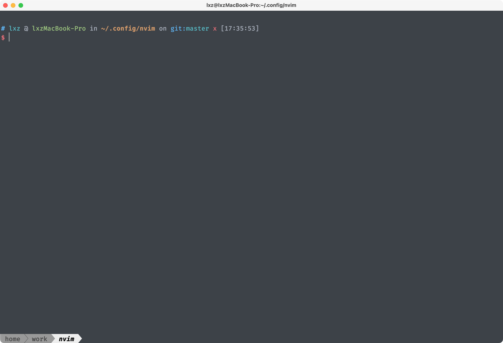
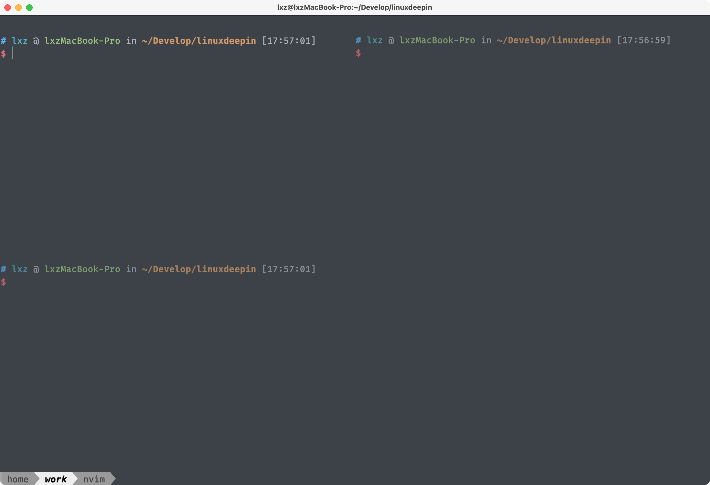

I've been using Kitty for a couple of days. I use it because there is a plugin for nvim that can seamlessly switch focus with kitty, so I don't need to repeat the settings, I like it very much.

After a period of use. I have completed part of the configuration, and now I want to share it.

I use different folders for related functions. Such as themes, tabs, windows, and shortcuts.

```shell
# lxz @ lxzMacBook-Pro in ~/.dot/kitty/.config/kitty on git:master o [16:38:58]
$ tree
.
├── kitty.conf
├── kitty.d
│   ├── init
│   │   └── init.conf
│   ├── keybind
│   │   ├── init.conf
│   │   ├── nvim.conf
│   │   ├── tab.conf
│   │   └── window.conf
│   ├── session
│   │   └── init.conf
│   └── theme
│       ├── background.conf
│       ├── color.conf
│       ├── font.conf
│       ├── tabbar.conf
│       └── window.conf
└── session.conf

6 directories, 13 files
```

## Some screenshot

### session (look at the lower left corner)




### multi splits



## Base settings

In kitty.conf, I just set to load configuration files in other directories.

```text
globinclude kitty.d/**/*.conf
```

I won't show the configuration after splitting, just give a hint according to the function.

## Init

In init.conf, I set some default variables.

```text
term xterm-256color
shell_integration enabled
allow_hyperlinks yes
editor nvim
```

## Theme settings

### Tabs settings

In tabs settings, I like `powerline` style.

```text
tab_bar_style powerline
```

### Windows settings

```text
window_border_width 0.5pt

window_resize_step_cells 2
window_resize_step_lines 2

initial_window_width  640
initial_window_height 400

draw_minimal_borders yes

inactive_text_alpha 0.7

hide_window_decorations no

macos_titlebar_color background
macos_thicken_font 0.75

active_border_color none

# default layout is vertical splits only
enabled_layouts splits

enable_audio_bell no
```

### Fonts settings

```text
font_family FiraCode Nerd Font Mono Retina
font_size 16.0
```

### Color settings

```text
# Dark One Nuanced by ariasuni, https://store.kde.org/p/1225908
# Imported from KDE .colorscheme format by thematdev, https://thematdev.org
# For migrating your schemes from Konsole format see
# https://git.thematdev.org/thematdev/konsole-scheme-migration


# importing Background
background #282c34
# importing BackgroundFaint
# importing BackgroundIntense
# importing Color0
color0 #3f4451
# importing Color0Faint
color16 #282c34
# importing Color0Intense
color8 #4f5666
# importing Color1
color1 #e06c75
# importing Color1Faint
color17 #c25d66
# importing Color1Intense
color9 #ff7b86
# importing Color2
color2 #98c379
# importing Color2Faint
color18 #82a566
# importing Color2Intense
color10 #b1e18b
# importing Color3
color3 #d19a66
# importing Color3Faint
color19 #b38257
# importing Color3Intense
color11 #efb074
# importing Color4
color4 #61afef
# importing Color4Faint
color20 #5499d1
# importing Color4Intense
color12 #67cdff
# importing Color5
color5 #c678dd
# importing Color5Faint
color21 #a966bd
# importing Color5Intense
color13 #e48bff
# importing Color6
color6 #56b6c2
# importing Color6Faint
color22 #44919a
# importing Color6Intense
color14 #63d4e0
# importing Color7
color7 #e6e6e6
# importing Color7Faint
color23 #c8c8c8
# importing Color7Intense
color15 #ffffff
# importing Foreground
foreground #abb2bf
# importing ForegroundFaint
# importing ForegroundIntense
# importing General
```

## Shortcuts settings

### Init

```text
# clear the terminal screen
map cmd+k combine : clear_terminal scrollback active : send_text normal,application \x0c

# jump to beginning and end of word
map alt+left send_text all \x1b\x62
map alt+right send_text all \x1b\x66

# jump to beginning and end of line
map cmd+left send_text all \x01
map cmd+right send_text all \x05

# Map cmd + <num> to corresponding tabs
map cmd+1 goto_tab 1
map cmd+2 goto_tab 2
map cmd+3 goto_tab 3
map cmd+4 goto_tab 4
map cmd+5 goto_tab 5
map cmd+6 goto_tab 6
map cmd+7 goto_tab 7
map cmd+8 goto_tab 8
map cmd+9 goto_tab 9

# changing font sizes
map cmd+equal    change_font_size all +2.0
map cmd+minus    change_font_size all -2.0
map cmd+0        change_font_size all 0

map cmd+c        copy_to_clipboard
map cmd+v        paste_from_clipboard
```

### Tab

```text
map alt+1 goto_tab 1
map alt+2 goto_tab 2
map alt+3 goto_tab 3
map alt+4 goto_tab 4
map alt+5 goto_tab 5
map alt+6 goto_tab 6
map alt+7 goto_tab 7
map alt+8 goto_tab 8
map alt+9 goto_tab 9
map alt+0 goto_tab 0

# open new tab with cmd+t
map cmd+t new_tab

# switch between next and previous splits
map cmd+]        next_window
map cmd+[        previous_window
```

### Window

```text
# open new split (window) with cmd+d retaining the cwd
map cmd+w close_window
map cmd+shif+n new_os_window
map cmd+d launch --location=hsplit --cwd=current
map cmd+shift+d launch --location=vsplit --cwd=current
```

### Neovim

```text
map ctrl+j kitten pass_keys.py neighboring_window bottom ctrl+j "^.* - nvim$"
map ctrl+k kitten pass_keys.py neighboring_window top    ctrl+k "^.* - nvim$"
map ctrl+h kitten pass_keys.py neighboring_window left   ctrl+h "^.* - nvim$"
map ctrl+l kitten pass_keys.py neighboring_window right  ctrl+l "^.* - nvim$"

# the 3 here is the resize amount, adjust as needed
map alt+j kitten pass_keys.py relative_resize down  3 alt+j "^.* - nvim$"
map alt+k kitten pass_keys.py relative_resize up    3 alt+k "^.* - nvim$"
map alt+h kitten pass_keys.py relative_resize left  3 alt+h "^.* - nvim$"
map alt+l kitten pass_keys.py relative_resize right 3 alt+l "^.* - nvim$"
```

Moving in shell and nvim.


## Session

Kitty supports session management, I added some default sessions, and opened session sockets for nvim.

The session.conf at the root is the location configuration of the session.

```text
new_tab home
layout splits
cd ~
launch zsh
focus

new_tab work
cd ~/Develop/linuxdeepin/
launch zsh

new_tab nvim
cd ~/.config/nvim
launch zsh
```

### Init

```text
startup_session session.conf

# Other unix systems:
allow_remote_control yes
listen_on unix:/tmp/.kitty
```
