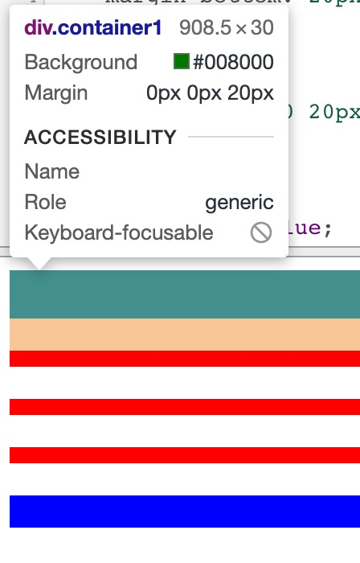
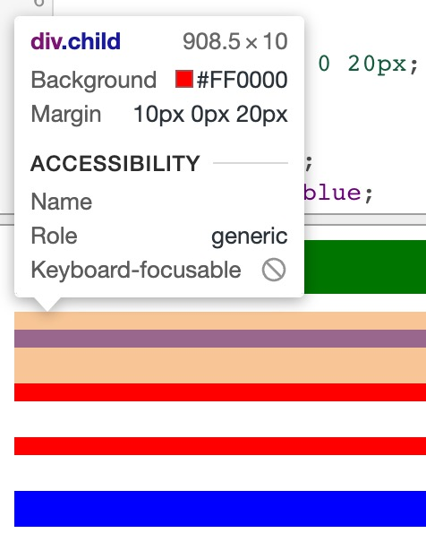

在学习 CSS 练习元素浮动的时候，我发现了一个奇怪的现象，就是上下两个块元素似乎距离太近了，无论我怎么增加上下 margins，始终都不会按照我预期的那样显示。

查阅了一些资料发现这是一个 CSS 的特定，叫 `外边距折叠`，在CSS中，两个或多个相邻的普通流中的盒子（可能是父子元素，也可能是兄弟元素）在垂直方向上的外边距会发生叠加，这种形成的外边距称之为外边距叠加。

W3C 对于外边距叠加的定义：

> In CSS, the adjoining margins of two or more boxes (which might or might not be siblings) can combine to form a single margin. Margins that combine this way are said to collapse, and the resulting combined margin is called a collapsed margin.

在 W3C 中，对相邻也有定义:

> Two margins are adjoining if and only if:
>
> - both belong to in-flow block-level boxes that participate in the same block formatting context
> - no line boxes, no clearance, no padding and no border separate them
> - both belong to vertically-adjacent box edges, i.e. form one of the following pairs:
>
>   - top margin of a box and top margin of its first in-flow child
>   - bottom margin of box and top margin of its next in-flow following sibling
>   - bottom margin of a last in-flow child and bottom margin of its parent if the > parent has "auto" computed height
>   - top and bottom margins of a box that does not establish a new block formatting context and that has zero computed "min-height", zero or "auto" computed "height", and no in-flow children

翻译：

> 两个边距相邻当且仅当：
>
> - 都属于普通流的块级盒子且参与到相同的块级格式上下文中
> - 没有被padding、border、clear和line box分隔开
> - 都属于垂直相邻盒子边缘：
>
>   - 盒子的top margin和它第一个普通流子元素的top margin
>   - 盒子的bottom margin和它下一个普通流兄弟的top margin
>   - 盒子的bottom margin和它父元素的bottom margin
>   - 盒子的top margin和bottom margin，且没有创建一个新的块级格式上下文，且有被计算为0的min-height，被计算为0或auto的height，且没有普通流子元素

下面来写一个小例子:

```css
.container1 {
    height: 30px;
    background: green;
    margin-bottom: 20px;
}

.container2 {
    margin: 10px 0 20px;
}
.container3 {
    height: 20px;
    background: blue;
    margin-top: 20px;
}
.child {
    background: red;
    height: 10px;
    margin: 10px 0 20px;
}

<div class="container1"></div>
<div class="container2">
    <div class="child"></div>
    <div class="child"></div>
    <div class="child"></div>
</div>
<div class="container3"></div>
```

显示效果如下:

<center>



</center>

<center>



</center>

可以看到，上一个元素的范围已经到了下一个元素的顶部，而下一个元素的上外边缘，已经被折叠在了一起。

这样的话我们就无法按照期望去布局了，那么有什么办法可以解决吗？

既然外边距的折叠是有条件的，只要想办法破坏条件，就可以避免这个问题了。

而且 W3C 也给出了解决办法:

> - Margins between a floated box and any other box do not collapse (not even between a float and its in-flow children).
> - Margins of elements that establish new block formatting contexts (such as floats and elements with "overflow" other than "visible") do not collapse with their in-flow children.
> - Margins of absolutely positioned boxes do not collapse (not even with their in-flow children).
> - Margins of inline-block boxes do not collapse (not even with their in-flow children).
> - The bottom margin of an in-flow block-level element always collapses with the top margin of its next in-flow block-level sibling, unless that sibling has clearance.
> - The top margin of an in-flow block element collapses with its first in-flow block-level child"s top margin if the element has no top border, no top padding, and the child has no clearance.
> - The bottom margin of an in-flow block box with a "height" of "auto" and a "min-height" of zero collapses with its last in-flow block-level child"s bottom margin if the box has no bottom padding and no bottom border and the child"s bottom margin does not collapse with a top margin that has clearance.
> - A box"s own margins collapse if the "min-height" property is zero, and it has neither top or bottom borders nor top or bottom padding, and it has a "height" of either 0 or "auto", and it does not contain a line box, and all of its in-flow children"s margins (if any) collapse.

翻译下就是:

> - 浮动元素不会与任何元素发生叠加，也包括它的子元素
> - 创建了 BFC 的元素不会和它的子元素发生外边距叠加
> - 绝对定位元素和其他任何元素之间不发生外边距叠加，也包括它的子元素
> - inline-block 元素和其他任何元素之间不发生外边距叠加，也包括它的子元素
> - 普通流中的块级元素的 margin-bottom 永远和它相邻的下一个块级元素的 margin-top 叠加，除非相邻的兄弟元素 clear
> - 普通流中的块级元素（没有 border-top、没有 padding-top）的 margin-top 和它的第一个普通流中的子元素（没有clear）发生 margin-top 叠加
> - 普通流中的块级元素（height为 auto、min-height为0、没有 border-bottom、没有 padding-bottom）和它的最后一个普通流中的子元素（没有自身发生margin叠加或clear）发生 margin-bottom叠加
> - 如果一个元素的 min-height 为0、没有 border、没有padding、高度为0或者auto、不包含子元素，那么它自身的外边距会发生叠加

还好以前写了一个浮动的笔记，可以拿来用。

跳转查看 