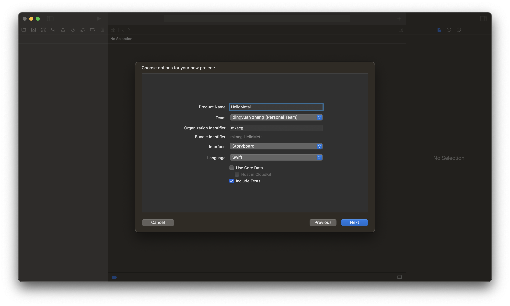
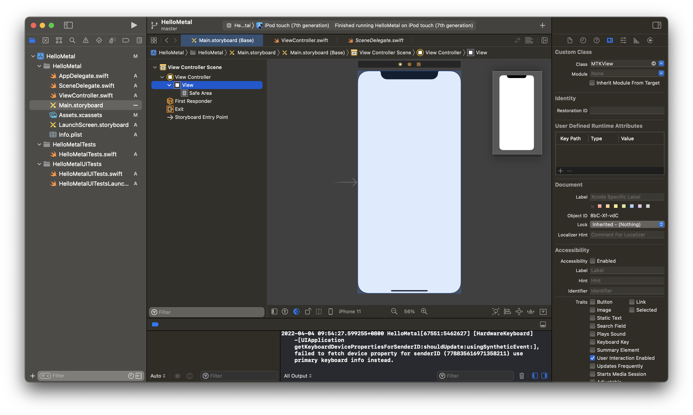
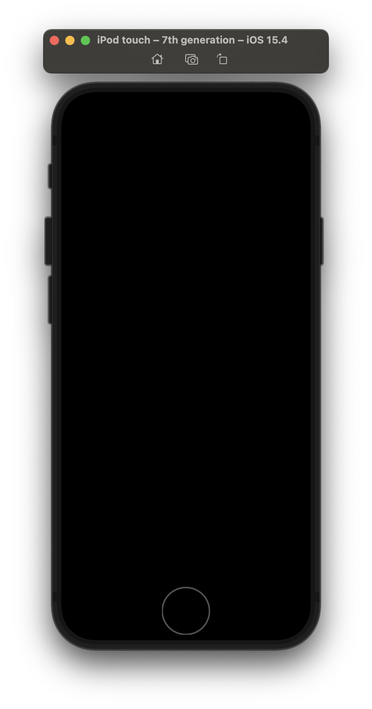
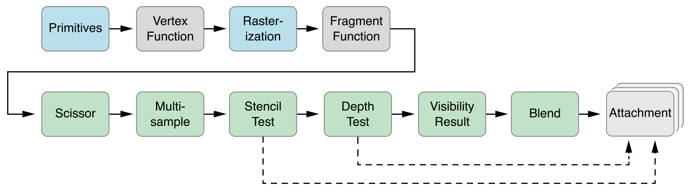
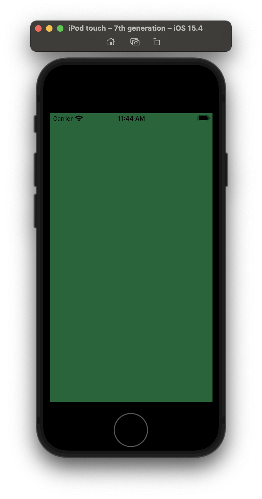

这个系列是我用来学习 Metal API 的笔记，我的最终目的是希望实现一个基于 Metal 的游戏引擎。

目前系列有:



<br>



<br>



<br>



<br>



------

Metal 是由苹果公司所开发的一个应用程序接口，兼顾图形与计算功能，面向底层、低开销的硬件加速。其类似于将OpenGL 与 OpenCL 的功能集成到了同一个API上。Metal也通过引入计算着色器来进一步提高GPGPU编程的能力。Metal 使用一种基于C++11的新着色语言，其实现借助了 Clang 和 LLVM。

从今天开始，我会开始写一个 Metal 的入门系列，作为我学习 Metal 的笔记和过程。我学习的平台以 `raywenderlich.com` 的视频为主，代码和流程也基本保持一致。

现在就让我们开始吧！

## 新建项目

首先打开 xcode，新建一个 iOS App，需要注意的是，interface 默认是 swiftui，需要修改成 Storyboard，应该使用 swiftui 也没有问题的，只是先按照教程一步步来吧。



### 设置 MTKView

当项目新建完成后，打开左侧的 `Main.storyboard` 文件，在中间选择到 `view Controller Scene` -> `View Controller` -> `View`，展开到 `View` 节点，并单击它。

右侧面板会显示该节点的详细信息，在最右侧选择 `Show the Identity inspector` 按钮，看起来像是名片按钮的，将 Class 修改为 `MTKView`，因为我们的界面不是普通的 View，而是使用 Metal 绘制的界面。



## 开启 Metal 之旅

### 导入 MetalKit

打开 `ViewController.swift` 文件，我们可以看到 xcode 已经自动生成了一部分代码，我们首先在 `import UIKit` 下一行写入 `import MetalKit`，用来导入 Metal API 相关的文件。

首先我们需要获取到界面上的 View，在 ViewController 类中写一个变量，用来访问 View。

增加代码:

```swift
var metalView: MTKView {
    return view as! MTKView
}
```

最终代码如下:

```swift
import UIKit
import MetalKit

class ViewController: UIViewController {
    var metalView: MTKView {
        return view as! MTKView
    }
    override func viewDidLoad() {
        super.viewDidLoad()
    }
}
```

访问 metaView 就是访问界面上的 view。

### 创建 Device

接下来就开始我们的 Metal 之旅，首先我们需要创建一个默认设备，这个设备是抽象的硬件资源，有了这个硬件，我们才可以去将着色器代码等各种代码发送到真正的设备上去使用。

在 metalView 中有个 device 成员，我们可以使用 `MTLCreateSystemDefaultDevice` 函数创建默认设备，我们就可以使用这个 `device` 了。

```swift
import UIKit
import MetalKit

class ViewController: UIViewController {
    var metalView: MTKView {
        return view as! MTKView
    }
    override func viewDidLoad() {
        super.viewDidLoad()
        metalView.device = MTLCreateSystemDefaultDevice()
    }
}
```

### 设置背景清除色

有了设备以后呢？

我们可以先给屏幕来一个清除色，或者叫背景色。

在 `ViewController.swift` 中新增一个枚举，使用 `MTLClearColor` 函数可以创建出所需的值。

```swift
enum Colors {
    static let wenderlichGreen = MTLClearColor(red: 0.0,
                                               green: 0.4,
                                               blue: 0.21,
                                               alpha: 1.0)
}
```

在 viewDidLoad 中我们为 metalView 设置 clear color。

```swift
metalView.clearColor = Colors.wenderlichGreen
```

这时候运行一下例子，然后就会发现屏幕是黑的，这是为啥捏？不是设置了背景色了吗？



哦吼吼，别忘了，和 OpenGL 一样，想要利用 GPU 去绘制画面，需要有顶点信息，由各种着色器处理过后，才能得到一幅画面，而我们还没有开始写着色器代码，也没有写绘制命令。

### 绘制

#### 命令队列

我们需要新建一个命令队列 MTLCommandQueue，用来缓冲我们的操作命令。

```swift
let commandQueue: MTLCommandQueue
```

在 viewDidLoad 函数中使用 `metalView.device.makeCommandQueue()!` 初始化 commandQueue。

还需要创建一个 MTLCommandBuffer 来缓冲命令，这里可能就有疑惑了，MTLCommandQueue 自己就是个队列，怎么还需要一个 buffer 呢？MTLCommandBuffer 是从 MTLCommandQueue 中创建出来的，用于本次绘制所需的全部状态，例如顶点信息、颜色、顶点连接顺序等等，当完成所有设置以后，就可以使用 commandBuffer.commit() 提交到队列中。

#### 命令编码

我们还需要一个 MTLRenderCommandEncoder，MTLRenderCommandEncoder 对象表示一个单独的图形渲染 command encoder。MTLParallelRenderCommandEncoder 对象使得一个单独的渲染 pass 被分成若干个独立的 MTLRenderCommandEncoder 对象，每一个都可以被分配到不同的线程。这些 command encoders 中的指令随后将串行起来，并以一致的可预测的顺序被执行。

这里是一张 Metal 渲染管线图。



#### 提交绘制

最终我们新增的代码是这样的:

```swift
commandQueue = metalView.device?.makeCommandQueue()
let commandBuffer = commandQueue.makeCommandBuffer()
let commandEncoder = commandBuffer?.makeRenderCommandEncoder(descriptor: metalView.currentRenderPassDescriptor!)

commandEncoder?.endEncoding()
commandBuffer?.present(metalView.currentDrawable!)
commandBuffer?.commit()
```

可以看到有些变量后面跟了一个!，它的意思是这里绝对不为空，是一种断言，同样还有?，它的意思是如果不为空就执行。

## 测试运行

我们已经完成了最终的代码，整个 ViewController.swift 的代码如下:

```swift
import UIKit
import MetalKit

enum Colors {
    static let wenderlichGreen = MTLClearColor(red: 0.0,
                                               green: 0.4,
                                               blue: 0.21,
                                               alpha: 1.0)
}

class ViewController: UIViewController {
    var metalView: MTKView {
        return view as! MTKView
    }
    var commandQueue: MTLCommandQueue!
    override func viewDidLoad() {
        super.viewDidLoad()
        metalView.device = MTLCreateSystemDefaultDevice()
        metalView.clearColor = Colors.wenderlichGreen
        commandQueue = metalView.device?.makeCommandQueue()
        let commandBuffer = commandQueue.makeCommandBuffer()
        let commandEncoder = commandBuffer?.makeRenderCommandEncoder(descriptor: metalView.currentRenderPassDescriptor!)

        commandEncoder?.endEncoding()
        commandBuffer?.present(metalView.currentDrawable!)
        commandBuffer?.commit()
    }
}
```



这时候就可以看到屏幕出现了绿色，这是我们设置的 clearColor。

本篇先讲了一个基本的 Metal 项目的使用，下一篇会开始讲顶点和着色器的用法，完成我们的第一个三角形。
