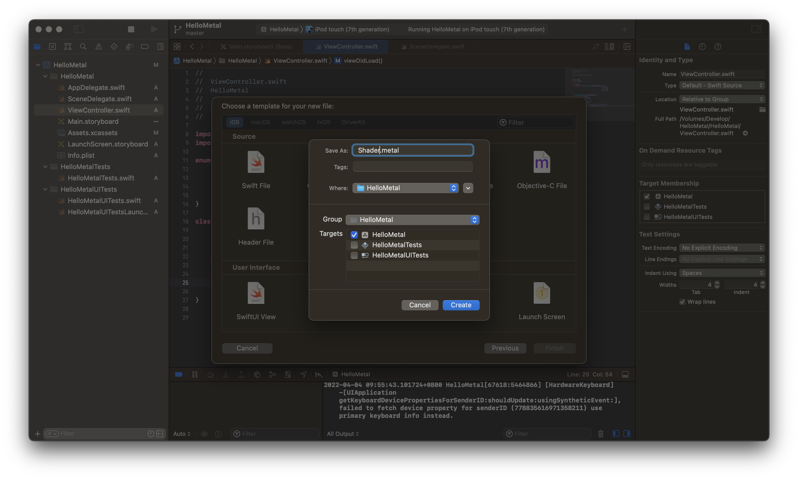

这个系列是我用来学习 Metal API 的笔记，我的最终目的是希望实现一个基于 Metal 的游戏引擎。

目前系列有:



<br>



<br>



<br>



<br>



------

今天听到了一句话，觉得很有道(ji)理(tang):

> **你所谓的顿悟，可能是别人的基本功**

自勉!

<div>

点击查看上一篇 
<p>
</div>

接上文，我们已经成功的提交了渲染命令到管线中，成功得到了渲染结果，所以我们需要开始写着色器代码，完成我们的第一个三角形，接下来让我们继续吧！

## 注意事项

Metal 的着色器语言是基于 C++ 11 的语言，对我来说比 OpenGL 的着色器语言更加熟悉。

但是需要注意的是

- Metal 中不支持 C++11 的如下特性：
  - Lambda 表达式
  - 递归函数调用
  - 动态转换操作符
  - 类型识别
  - 对象创建 new 和销毁 delete 操作符
  - 操作符 noexcept
  - goto
  - 变量存储修饰符 register 和 thread_local
  - 虚函数修饰符
  - 派生类
  - 异常处理
- C++ 标准库在 Metal 语言中也不可使用
- Metal 语言对于指针使用的限制
- Metal 图形和并行计算函数用到的入参（比如指针 / 引用），如果是指针 / 引用必须使用地址空间修饰符（比如 device、threadgroup、constant）
- 不支持函数指针
- 函数名不能出现 main

## 着色器

在 xcode 左侧对着 ViewController.swift 右键，选择 New File，新建 Metal File，起名为 Shader 就可以创建一个着色器文件。



xcode 会帮助我们自动生成一部分代码，比如默认帮助我们 include 了 metal_stdlib。

### 顶点着色器

我们首先新建一个 vertex_shader 的函数，让顶点着色器去执行这个函数。

```metal
vertex float4 vertex_shader(const device packed_float3 *vertices [[ buffer(0) ]],
                           uint vertexId [[ vertex_id ]]) {
    float4 position = float4(vertices[vertexId], 1);
    return position;
}
```

熟悉 OpenGL 或者其他 GPU 编程的人应该很熟悉，float4 就是一个向量。在参数中的 `[[ buffer(0) ]]`，是在代码部分设置的顶点缓冲区 id，`[[ vertex_id ]]` 顶点id 标识符。

### 片元着色器

除了顶点着色器函数，我们还需要准备一个片元着色器函数。

```metal
fragment half4 fragment_shader() {
    return half4(1, 0, 0, 1);
}
```

啊这，half4 是个什么玩意儿。

查了一波 Apple 的文档，发现 half 是 16位的浮点数，所以这里其实我们用 float4 也是可以的，**虽说是跟着教程跑，但是也要理解一下为什么要这么用**。

片元着色器代码其实就返回了一个红色，没有任何的参数，所以当我们成功运行以后，我们应该看到红色。

## 绘制

已经完成了基本的着色器代码，那么就可以开始使用它了。回到 ViewController.swift，我们首先需要创建一个顶点数组，我们依赖这些顶点信息去构建空间中，以三角形为基本的面。

### 顶点数组

新增一个变量，用来保存顶点数组:

```swift
var vertices: [Float] = [
    0,  1, 0,
   -1, -1, 0,
    1, -1, 0
]
```

我们都知道，三个点可以形成一个面，形成的就是三角形，在计算机中使用顶点 vertex 来保存空间信息，并且顶点不仅仅是用来保存坐标的，还可以保存其他信息，比如某个点的颜色，某个点的法线等等。

由于空间是三维空间，所以我们将 Z 轴都设置为 0，这样三角形就只需要关心 X 轴和 Y 轴了。

但是需要注意的是，此时我们的顶点信息，还只是没有意义的点，甚至连点都算不上，因为我们还没有“规定”它是什么。

### 顶点缓冲区

我们需要创建一个 MTLBuffer 对象来保存顶点缓冲区，只有经过处理的顶点缓冲区才是我们需要的。

```swift
var vertexBuffer: MTLBuffer?

private func buildModel() {
  vertexBuffer = device.makeBuffer(bytes: vertices,
                                    length: vertices.count * MemoryLayout<Float>.size,
                                    options: [])
}
```

为了方便使用 device 对象，增加一个变量来保存初始化的 device。在 viewDidLoad 函数中调用 buildModel，初始化顶点缓冲区。

### PipelineState

为了使用 MTLRenderCommandEncoder 对象来编码渲染指令，必须先设置一个 MTLRenderPipelineState 对象来定义每个绘制命令的图形状态。

一个渲染管线 state 对象是一个拥有长生命周期的对象，它可以在 render command encoder 对象生效范围外被创建，最后可以被缓存起来，然后被重用于多个 render command encoder 对象。当描述相同的图形状态，重用先前创建的渲染管线 state 对象，这样可以避免高成本的重新评估和转换操作（将特定状态转换成 GPU 指令）。

渲染管线 state 对象是一个不可变对象。要创建一个渲染管线 state 对象，首先创建一个可变的 MTLRenderPipelineDescriptor 对象，它描述了渲染管线 state 的属性。然后你可以使用这个 descriptor 来创建一个 MTLRenderPipelineState 对象。

我们新增一个函数用来初始化 MTLRenderPipelineState。

```swift
var pipelineState: MTLRenderPipelineState
private func buildPipelineState() {
    let library            = device.makeDefaultLibrary()
    let vertexFunction     = library?.makeFunction(name: "vertex_shader")
    let fragmentFunction   = library?.makeFunction(name: "fragment_shader")
    let pipelineDescriptor = MTLRenderPipelineDescriptor()

    pipelineDescriptor.vertexFunction                  = vertexFunction
    pipelineDescriptor.fragmentFunction                = fragmentFunction
    pipelineDescriptor.colorAttachments[0].pixelFormat = .bgra8Unorm

    do {
        pipelineState = try device.makeRenderPipelineState(descriptor: pipelineDescriptor)
    } catch let error as NSError {
        print("error: \(error.localizedDescription)")
    }
}
```

使用 device.makeDefaultLibrary() 可以创建一个 library 对象，用来获取上面创建的着色器函数，Metal 会在项目编译时就完成着色器编译，这点和 OpenGL 是不同的。

我们只需要为 MTLRenderPipelineDescriptor 设置顶点着色器函数、片元着色器函数和颜色格式就行了。

最后在 viewDidLoad 中调用该函数即可。

### 绘制三角形

准备工作已经接近尾声了，我们现在可以向 commandEncoder 中编码命令了。

- 为 commandEncoder 设置 pipelineState
- 为 commandEncoder 设置 vertexBuffer
- 为 commandEncoder 设置 绘制三角形命令


在 commandEncoder?.endEncoding() 前插入代码:

```swift
commandEncoder?.setRenderPipelineState(pipelineState)
commandEncoder?.setVertexBuffer(vertexBuffer,
                                offset: 0,
                                index: 0)
commandEncoder?.drawPrimitives(type: .triangle,
                                vertexStart: 0,
                                vertexCount: vertices.count)
```

setVertexBuffer 函数的 index 参数就是着色器中，vertex_shader 参数的 `[[ buffer(0) ]]`，我们没有设置偏移，那么坐标信息就是从 0 开始读取。

这里提一下为什么会有 offset，有时候我们会准备一份顶点信息，只需要送一次给 GPU，不同的着色器可以通过 offset 读取同一份顶点缓冲，只需要按偏移使用就可以了。

drawPrimitives 函数是告诉 GPU，嘿哥们，我给你的顶点是用来画三角形的，请你三个一组的使用。

最终我们成功的绘制了一个红色的三角形。


## 完整代码

### ViewController

```swift
//
//  ViewController.swift
//  HelloMetal
//
//  Created by lxz on 2022/4/4.
//

import UIKit
import MetalKit

enum Colors {
    static let wenderlichGreen = MTLClearColor(red: 0.0,
                                               green: 0.4,
                                               blue: 0.21,
                                               alpha: 1.0)
}

class ViewController: UIViewController {
    var metalView: MTKView {
        return view as! MTKView
    }
    var commandQueue: MTLCommandQueue!
    var device: MTLDevice!
    var vertexBuffer: MTLBuffer?
    var vertices: [Float] = [
        0,  1, 0,
       -1, -1, 0,
        1, -1, 0
    ]
    var pipelineState: MTLRenderPipelineState!
    override func viewDidLoad() {
        super.viewDidLoad()
        device = MTLCreateSystemDefaultDevice()
        metalView.device = device
        metalView.clearColor = Colors.wenderlichGreen
        commandQueue = device.makeCommandQueue()

        buildModel()
        buildPipelineState()

        let commandBuffer = commandQueue.makeCommandBuffer()
        let commandEncoder = commandBuffer?.makeRenderCommandEncoder(descriptor: metalView.currentRenderPassDescriptor!)

        commandEncoder?.setRenderPipelineState(pipelineState)
        commandEncoder?.setVertexBuffer(vertexBuffer,
                                        offset: 0,
                                        index: 0)
        commandEncoder?.drawPrimitives(type: .triangle,
                                       vertexStart: 0,
                                       vertexCount: vertices.count)

        commandEncoder?.endEncoding()
        commandBuffer?.present(metalView.currentDrawable!)
        commandBuffer?.commit()
    }
    private func buildModel() {
      vertexBuffer = device.makeBuffer(bytes: vertices,
                                       length: vertices.count * MemoryLayout<Float>.size,
                                       options: [])
    }
    private func buildPipelineState() {
        let library            = device.makeDefaultLibrary()
        let vertexFunction     = library?.makeFunction(name: "vertex_shader")
        let fragmentFunction   = library?.makeFunction(name: "fragment_shader")
        let pipelineDescriptor = MTLRenderPipelineDescriptor()

        pipelineDescriptor.vertexFunction                  = vertexFunction
        pipelineDescriptor.fragmentFunction                = fragmentFunction
        pipelineDescriptor.colorAttachments[0].pixelFormat = .bgra8Unorm

        do {
            pipelineState = try device.makeRenderPipelineState(descriptor: pipelineDescriptor)
        } catch let error as NSError {
            print("error: \(error.localizedDescription)")
        }
    }
}
```

### Shader

```metal
//
//  Shader.metal
//  HelloMetal
//
//  Created by lxz on 2022/4/4.
//

#include <metal_stdlib>
using namespace metal;

vertex float4 vertex_shader(const device packed_float3 *vertices [[ buffer(0) ]],
                           uint vertexId [[ vertex_id ]]) {
    float4 position = float4(vertices[vertexId], 1);
    return position;
}

fragment half4 fragment_shader() {
    return half4(1, 0, 0, 1);
}

```
