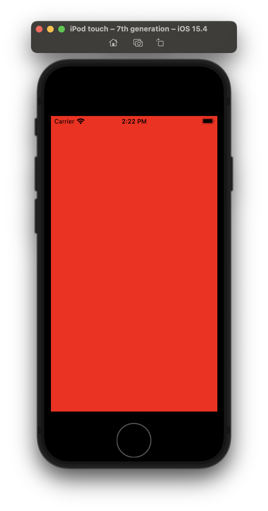

这个系列是我用来学习 Metal API 的笔记，我的最终目的是希望实现一个基于 Metal 的游戏引擎。

目前系列有:



<br>



<br>



<br>



<br>



------

<div>

点击查看上一篇 
<p>
</div>

上一篇文章其实已经把基础内容讲完了，我们已经把绘制的流程走通了，这篇文章会说一下如何绘制一个四边形。

## 重构代码

首先我们需要稍微重构一下代码，现在的代码都耦合在一个函数里，这对我们非常的不好，我们抽出来一个 Renderer 的文件，专门存放绘制代码。

首先基于 NSObject 派生出 Renderer 类，将各种成员变量都转移到这里，并在在构造函数接受最重要的 MTLDevice 对象。

```swift
//
//  Renderer.swift
//  HelloMetal
//
//  Created by lxz on 2022/4/4.
//

import MetalKit

enum Colors {
    static let wenderlichGreen = MTLClearColor(red: 0.0,
                                               green: 0.4,
                                               blue: 0.21,
                                               alpha: 1.0)
}

class Renderer: NSObject {
    let device: MTLDevice
    let commandQueue: MTLCommandQueue
    var vertices: [Float] = [
        0,  1, 0,
       -1, -1, 0,
        1, -1, 0
    ]
    var pipelineState: MTLRenderPipelineState?
    var vertexBuffer: MTLBuffer?

    init(device: MTLDevice) {
        self.device = device
        commandQueue = device.makeCommandQueue()!
        super.init()
        buildModel()
        buildPipelineState()
    }

    private func buildModel() {
        vertexBuffer = device.makeBuffer(bytes: vertices,
                                         length: vertices.count * MemoryLayout<Float>.size,
                                         options: [])
    }

    private func buildPipelineState() {
        let library = device.makeDefaultLibrary()
        let vertexFunction = library?.makeFunction(name: "vertex_shader")
        let fragmentFunction = library?.makeFunction(name: "fragment_shader")

        let pipelineDescriptor = MTLRenderPipelineDescriptor()
        pipelineDescriptor.vertexFunction = vertexFunction
        pipelineDescriptor.fragmentFunction = fragmentFunction
        pipelineDescriptor.colorAttachments[0].pixelFormat = .bgra8Unorm

        do {
            pipelineState = try device.makeRenderPipelineState(descriptor: pipelineDescriptor)
        } catch let error as NSError {
            print("error: \(error.localizedDescription)")
        }
    }
}
```

我们把所有的代码都转移到新的类中，只需要在 ViewController 中保留 Renderer 对象就可以了。

```swift
//
//  ViewController.swift
//  HelloMetal
//
//  Created by lxz on 2022/4/4.
//

import UIKit
import MetalKit

class ViewController: UIViewController {
    var metalView: MTKView {
        return view as! MTKView
    }
    var renderer: Renderer!
    override func viewDidLoad() {
        super.viewDidLoad()
        metalView.device = MTLCreateSystemDefaultDevice()
        metalView.clearColor = Colors.wenderlichGreen
        renderer = Renderer(device: metalView.device!)
    }
}
```

metalView 支持 delegate，我们可以让 Renderer 派生自 MTKViewDelegate，就可以将原本绘制三角形部分的代码转移到 draw 函数中。

```swift
extension Renderer: MTKViewDelegate {
    func mtkView(_ view: MTKView, drawableSizeWillChange size: CGSize) {
    }
    func draw(in view: MTKView) {
        let commandBuffer = commandQueue.makeCommandBuffer()
        let commandEncoder = commandBuffer?.makeRenderCommandEncoder(descriptor: view.currentRenderPassDescriptor!)

        commandEncoder?.setRenderPipelineState(pipelineState!)
        commandEncoder?.setVertexBuffer(vertexBuffer,
                                        offset: 0,
                                        index: 0)
        commandEncoder?.drawPrimitives(type: .triangle,
                                       vertexStart: 0,
                                       vertexCount: vertices.count)

        commandEncoder?.endEncoding()
        commandBuffer?.present(view.currentDrawable!)
        commandBuffer?.commit()
    }
}
```

回到 ViewController.swift 中，我们需要在 viewDidLoad 函数中将 metalView 的 delegate 设置为 renderer。

```swift
metalView.delegate = renderer
```

swift 提供一个 guard 的语法，可以方便的进行一些检查，可以把 draw 里一定存在的变量统一检查，如果任何一个不存在，都会运行到 else 中。

```swift
guard let drawable = view.currentDrawable,
      let pipelineState = pipelineState,
      let descriptor = view.currentRenderPassDescriptor
else {
    return
}
```

## 顶点索引

在上一篇讲过，顶点数组需要处理成顶点缓冲区，如果我们准备画一个四边形，正常来说我们需要准备两份三角形的坐标，但是！注意了，但是啊！由于两个三角形的斜边其实是同一条，那么意味着两个三角形的两个顶点，其实坐标是一样的，他们是重复的，如果我们完整的发送了全部顶点信息，虽然可以正常使用，但是数据量比较大的时候，就会浪费更多的资源。

一个模型通常由上万个三角形组成，每两个三角形都会浪费两个顶点，那么浪费掉的空间就不能忽略了，所以 Metal、OpenGL 这些 API 都提供了顶点索引功能，我们只需要发送顶点的坐标，然后使用顶点索引将点联系起来，这样就不用发送重复的顶点信息，只需要告诉 GPU，嘿老兄，这个点又被我用了，麻烦你读取一下吧。

我们将顶点数组换成这样的数据:

```swift
var vertices: [Float] = [
    -1,  1, 0, // 左上角
    -1, -1, 0, // 左下角
     1, -1, 0, // 右下角
     1,  1, 0, // 右上角
]
```

我们创建一个 indices，用来保存顶点索引，同样是三位一组，一共两组，使用了顶点数组中的三组坐标信息。

```swift
let indices: [UInt16] = [
    0, 1, 2, // 左边的三角形
    2, 3, 0  // 右边的三角形
]
```

同样的，我们还需要使用一个 MTLBuffer 保存顶点索引缓存。

```swift
var indexBuffer: MTLBuffer?
```

在 buildModel 函数里初始化顶点索引缓存。

```swift
indexBuffer = device.makeBuffer(bytes: indices,
                                length: indices.count * MemoryLayout<UInt16>.size,
                                options: [])
```

## 绘制四边形

我们已经有顶点缓冲了，也有顶点索引缓冲，可以去试一下了。

在 guard 中赋值一下，保证它不为空。

```swift
guard let drawable = view.currentDrawable,
      let pipelineState = pipelineState,
      let indexBuffer = indexBuffer,
      let descriptor = view.currentRenderPassDescriptor
else {
    return
}
```

接下来就是比较重要的部分了，我们要如何使用顶点索引呢？

MTLCommandEncoder 有一个 drawIndexedPrimitives 函数，可以接受顶点索引缓冲。

```swift
commandEncoder?.drawIndexedPrimitives(type: .triangle,
                                      indexCount: indices.count,
                                      indexType: .uint16,
                                      indexBuffer: indexBuffer,
                                      indexBufferOffset: 0)
```

让我们运行一下吧！



非常棒，我们看到整个屏幕都是红色了。

## 完整代码

```swift
//
//  Renderer.swift
//  HelloMetal
//
//  Created by lxz on 2022/4/4.
//

import MetalKit

enum Colors {
    static let wenderlichGreen = MTLClearColor(red: 0.0,
                                               green: 0.4,
                                               blue: 0.21,
                                               alpha: 1.0)
}

class Renderer: NSObject {
    let device: MTLDevice
    let commandQueue: MTLCommandQueue
    var vertices: [Float] = [
        -1,  1, 0, // 左上角
        -1, -1, 0, // 左下角
         1, -1, 0, // 右下角
         1,  1, 0, // 右上角
    ]
    let indices: [UInt16] = [
        0, 1, 2, // 左边的三角形
        2, 3, 0  // 右边的三角形
    ]
    var pipelineState: MTLRenderPipelineState?
    var vertexBuffer: MTLBuffer?
    var indexBuffer: MTLBuffer?

    init(device: MTLDevice) {
        self.device = device
        commandQueue = device.makeCommandQueue()!
        super.init()
        buildModel()
        buildPipelineState()
    }

    private func buildModel() {
        vertexBuffer = device.makeBuffer(bytes: vertices,
                                         length: vertices.count * MemoryLayout<Float>.size,
                                         options: [])
        indexBuffer = device.makeBuffer(bytes: indices,
                                        length: indices.count * MemoryLayout<UInt16>.size,
                                        options: [])
    }

    private func buildPipelineState() {
        let library = device.makeDefaultLibrary()
        let vertexFunction = library?.makeFunction(name: "vertex_shader")
        let fragmentFunction = library?.makeFunction(name: "fragment_shader")

        let pipelineDescriptor = MTLRenderPipelineDescriptor()
        pipelineDescriptor.vertexFunction = vertexFunction
        pipelineDescriptor.fragmentFunction = fragmentFunction
        pipelineDescriptor.colorAttachments[0].pixelFormat = .bgra8Unorm

        do {
            pipelineState = try device.makeRenderPipelineState(descriptor: pipelineDescriptor)
        } catch let error as NSError {
            print("error: \(error.localizedDescription)")
        }
    }
}

extension Renderer: MTKViewDelegate {
    func mtkView(_ view: MTKView, drawableSizeWillChange size: CGSize) {
    }
    func draw(in view: MTKView) {
        guard let drawable = view.currentDrawable,
              let pipelineState = pipelineState,
              let indexBuffer = indexBuffer,
              let descriptor = view.currentRenderPassDescriptor
        else {
            return
        }

        let commandBuffer = commandQueue.makeCommandBuffer()
        let commandEncoder = commandBuffer?.makeRenderCommandEncoder(descriptor: view.currentRenderPassDescriptor!)

        commandEncoder?.setRenderPipelineState(pipelineState)
        commandEncoder?.setVertexBuffer(vertexBuffer,
                                        offset: 0,
                                        index: 0)

        commandEncoder?.drawIndexedPrimitives(type: .triangle,
                                              indexCount: indices.count,
                                              indexType: .uint16,
                                              indexBuffer: indexBuffer,
                                              indexBufferOffset: 0)

        commandEncoder?.endEncoding()
        commandBuffer?.present(view.currentDrawable!)
        commandBuffer?.commit()
    }
}
```

```c++
//
//  Shader.metal
//  HelloMetal
//
//  Created by lxz on 2022/4/4.
//

#include <metal_stdlib>
using namespace metal;

vertex float4 vertex_shader(const device packed_float3 *vertices [[ buffer(0) ]],
                            uint vertexId [[ vertex_id ]]) {
    float4 position = float4(vertices[vertexId], 1);
    return position;
}

fragment half4 fragment_shader() {
    return half4(1, 0, 0, 1);
}
```

```swift
//
//  ViewController.swift
//  HelloMetal
//
//  Created by lxz on 2022/4/4.
//

import UIKit
import MetalKit

class ViewController: UIViewController {
    var metalView: MTKView {
        return view as! MTKView
    }
    var renderer: Renderer!
    override func viewDidLoad() {
        super.viewDidLoad()
        metalView.device = MTLCreateSystemDefaultDevice()
        metalView.clearColor = Colors.wenderlichGreen
        renderer = Renderer(device: metalView.device!)
        metalView.delegate = renderer
    }
}
```
