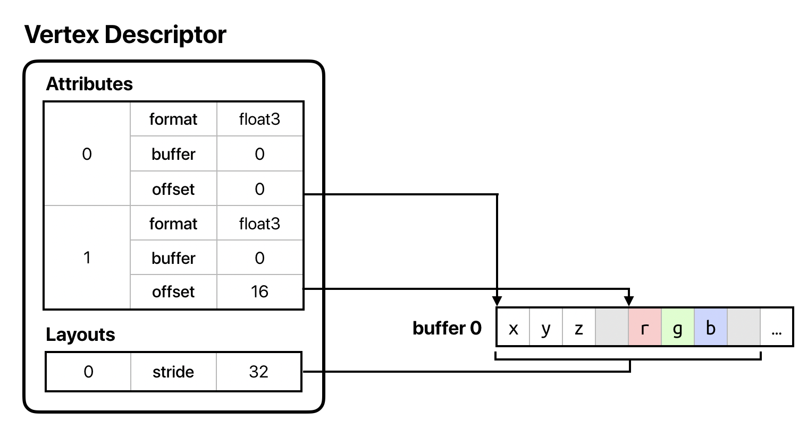
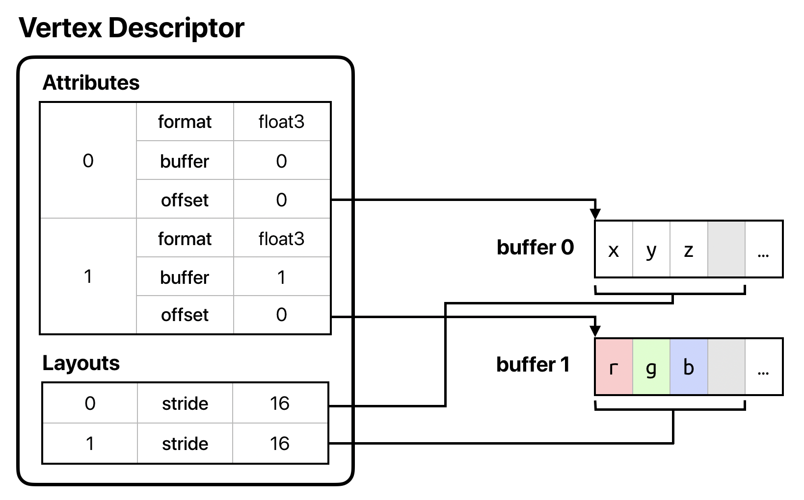
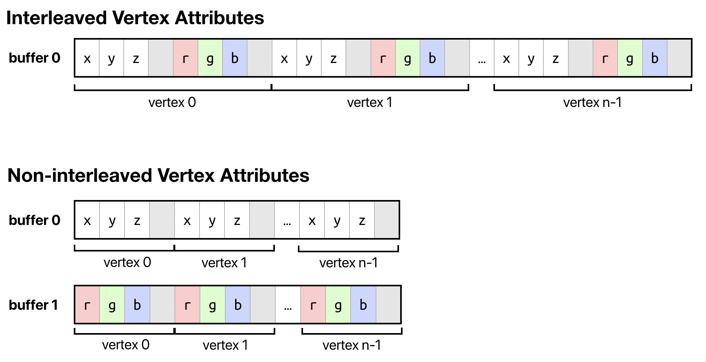
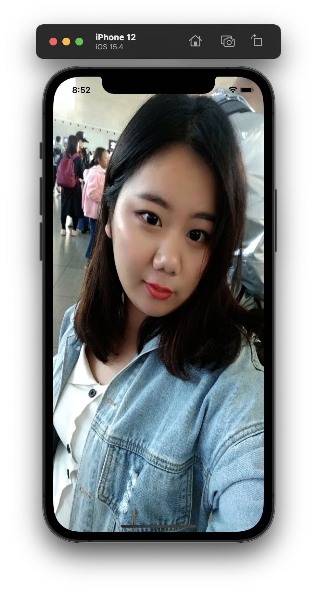
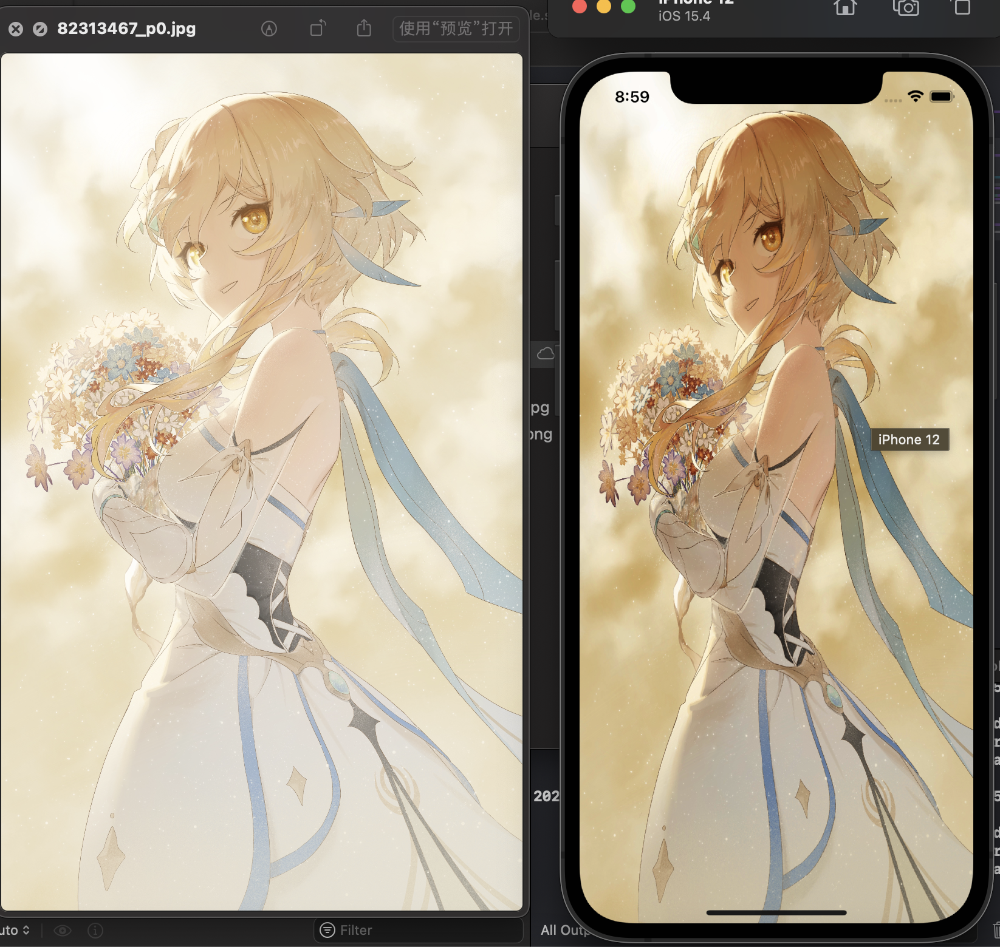

这个系列是我用来学习 Metal API 的笔记，我的最终目的是希望实现一个基于 Metal 的游戏引擎。

目前系列有:



<br>



<br>



<br>



<br>



------

<div>

点击查看上一篇 
<p>
</div>

上一篇我们成功的绘制了一个四边形，并且运行了一个简单的动画，今天我们来一起搞定材质贴图。

在前面的文章里已经介绍到了，我们通过两个三角形组合成了一个矩形，并且为每个顶点都增加偏移，以便我们在外部控制每帧绘制时坐标偏移。

在发送数据给 GPU 时，在 CPU 端准备的数据，必须设定好内存布局，然后在 shader 中接受时，也要使用相同的内存布局，否则读取就会出现问题，这也是为什么我们很多地方都在计算 offset 的原因。

这次我们拆分下数据，将原本一个 buffer 中的顶点数据，拆分为多个 buffer，一同发送给 GPU。

## 多条 MTLBuffer

在 MTLVertexDescriptor 中我们可以添加多条 attributes，需要指定一个新的 bufferIndex，因为每一条属性对应了新的 MTLBuffer。

```swift
let vertexDescriptor = MTLVertexDescriptor()

// position
vertexDescriptor.attributes[0].format = .float3
vertexDescriptor.attributes[0].offset = 0
vertexDescriptor.attributes[0].bufferIndex = 0

// color
vertexDescriptor.attributes[1].format = .float4
vertexDescriptor.attributes[1].offset = 0
vertexDescriptor.attributes[1].bufferIndex = 1

vertexDescriptor.layouts[0].stride = MemoryLayout<simd_float4>.stride
vertexDescriptor.layouts[1].stride = MemoryLayout<simd_float4>.stride
```

每条 attributes 设置完毕后，我们还需要指定三条布局，和之前的指令相比，相当于我们将所有数据放在一条 buffer中，现在我们拆分成并行的数据，一块发送给 GPU。



在这张图中可以看出，内存布局是由 layout 决定的，数据是由 attributes 组成。



多条缓冲区是单条缓冲区的结构复制，会并行将数据都发送到 GPU。



设置好内存布局以后，我们就需要创建对应的 MTLBuffer 来保存独立的顶点数据。

```swift
var positionBuffer: MTLBuffer?
var colorBuffer: MTLBuffer?
```

在我们的 buildModel 函数中将数据初始化。

```swift
positionBuffer = device.makeBuffer(bytes: positionVertices,
                                  length: positionVertices.count * MemoryLayout<simd_float4>.size,
                                  options: [])
colorBuffer = device.makeBuffer(bytes: colorVertices,
                                length: colorVertices.count * MemoryLayout<simd_float4>.size,
                                options: [])
```

然后我们需要将顶点数据发送到 GPU，在 draw 函数中，将原本的 commandEncoder.setVertexBuffer 删除，并使用新的 MTLBuffer，而且需要注意的是，index 参数需要和 MTLVertexDescriptor 中的 index 保持一致，否则就无法正确的读取。

```swift
commandEncoder.setVertexBuffer(positionBuffer,
                                offset: 0,
                                index: 0)
commandEncoder.setVertexBuffer(colorBuffer,
                                offset: 0,
                                index: 1)
```

那么数据发送到 GPU 之后，shader 要如何使用数据呢？

我们需要在 shader 中增加一个结构体，并使用一些语法标记。

```shader
struct VertexIn {
    float4 position [[ attribute(0) ]];
    float4 color [[ attribute(1) ]];
};

struct VertexOut {
    float4 position [[ position ]];
    float4 color;
};
```

`[[ attribute(0) ]]` 的意思就是为了取得对应的 attributes。

还需要修改一下顶点着色器代码，传入结构体。

```shader
vertex VertexOut vertex_shader(const VertexIn vertexIn [[ stage_in ]]) {
    VertexOut vertexOut;
    vertexOut.position = vertexIn.position;
    vertexOut.color = vertexIn.color;

    return vertexOut;
}
```

我们注意到，参数里有一个 `[[ stage_in ]]` 的标记，`[[ stage_in ]]` 可以修饰结构体，参数中只允许有一个参数使用该标记进行修饰。

由于我们的顶点是原始信息，所以只需要正常的赋值新的结构体，然后返回即可。

## 绘制材质

材质贴图又称为纹理，纹理也有像素的称呼，但是需要区分一下，这里的像素并不是指屏幕上的物理像素。纹理使用不一样的坐标系，其原点在左上角，并且可以使用归一化将坐标系压缩至 (0.0, 1.0)，当然不强制使用归一化坐标系，但是当你想使用不同分辨率的纹理时，只要映射关系正确，就可以正常工作。

绘制材质需要先进行顶点映射，材质的坐标系与顶点的坐标系不相同，所以我们需要提供一种映射，在执行片元着色器时，获取到某个位置正确的图片颜色。

### 坐标映射

我们在 vertexDescriptor 中增加一条新的属性，用来保存映射关系。

```swift
// texture
vertexDescriptor.attributes[2].format = .float2
vertexDescriptor.attributes[2].offset = 0
vertexDescriptor.attributes[2].bufferIndex = 2

vertexDescriptor.layouts[2].stride = MemoryLayout<simd_float2>.stride
```

创建新的 MTLBuffer，保存映射关系。由于我们只使用了四个顶点，两个三角形组成了矩形，所以我们只需要将四个点的坐标对应起来就可以了。

```swift
textureBuffer = device.makeBuffer(bytes: textureVertices,
                                  length: textureVertices.count * MemoryLayout<simd_float2>.size,
                                  options: [])
```

在 draw 函数中，我们增加新的顶点信息。

```swfit
commandEncoder.setVertexBuffer(textureBuffer,
                               offset: 0,
                               index: 2)
```

在 shader 的结构体中增加属性的接收。

```swift
struct VertexIn {
    float4 position [[ attribute(0) ]];
    float4 color [[ attribute(1) ]];
    float2 textureCoordinates [[ attribute(2) ]];
};

struct VertexOut {
    float4 position [[ position ]];
    float4 color;
    float2 textureCoordinates;
};

vertex VertexOut vertex_shader(const VertexIn vertexIn [[ stage_in ]]) {
    VertexOut vertexOut;
    vertexOut.position = vertexIn.position;
    vertexOut.color = vertexIn.color;
    vertexOut.textureCoordinates = vertexIn.textureCoordinates;

    return vertexOut;
}
```

### 读取文件

好，我们现在已经成功的设置好了顶点属性，可是我们还没有讲如何读取文件呢。

首先，在 Metal 中，材质的读取是通过 MTKTextureLoader 创建一个加载器，可以使用它提供的 newTexture 方法创建一个 MTLTexture 对象。

```swift
func createTexture(device: MTLDevice, imageName: String) -> MTLTexture? {
    let textureLoader = MTKTextureLoader(device: device)
    var texture: MTLTexture? = nil
    // change direction
    let textureLoaderOptions: [MTKTextureLoader.Option: Any] = [.origin: MTKTextureLoader.Origin.bottomLeft]
    //let textureLoaderOptions: [MTKTextureLoader.Option: Any] = [:]
    if let textureURL = Bundle.main.url(forResource: imageName, withExtension: nil) {
        do {
            texture = try textureLoader.newTexture(URL: textureURL, options: textureLoaderOptions)
        } catch {
            print("texture not created")
        }
    }
    return texture
}
```

在上面的代码中，我通过 MTKTextureLoader.Option 修改了坐标系的方向，将原点从左上角改为左下角（第四象限位置改为第一象限），可以不用修改，仅仅是个人喜好。

### 设置采样

根据一般的流程，这个时候应该会先说画出来，然后发现画面比较模糊，这时候才开始说采样需要调整。

我不按套路，我就是要先讲采样，略略略。

Metal 使用 MTLSamplerDescriptor 来控制采样，我才用最基本的线性采样。Metal 的着色器工作流程是，先执行顶点着色器，处理顶点的坐标信息，再执行光栅化，确定像素边界，裁剪超出的像素。当光栅化结束后，执行片元着色器，计算每个像素的颜色。我们在片元着色器中使用材质，为片元着色器传入材质、顶点信息和采样属性，就可以完成像素颜色的输出。

```swift
var samplerState: MTLSamplerState?
private func buildSamplerState(device: MTLDevice) {
    let descriptor = MTLSamplerDescriptor()
    descriptor.minFilter = .linear
    descriptor.magFilter = .linear
    samplerState = device.makeSamplerState(descriptor: descriptor)
}
```

在构造函数中执行该函数，就可以完成 MTLSamplerState 构建。

紧接着，我们为 MTLCommandEncoder 设置片元采样状态。

```swift
commandEncoder.setFragmentSamplerState(node.samplerState, index: 0)
```

在 shader 中修改片元着色器代码，使用上面设置好的全部信息。

```shader
fragment half4 fragment_shader(VertexOut vertexIn [[ stage_in ]],
                               sampler sampler2d [[ sampler(0) ]],
                               texture2d<float> texture [[ texture(0) ]])
{
    float4 color = texture.sample(sampler2d, vertexIn.textureCoordinates);
    return half4(color.r, color.g, color.b, 1);
}
```

在参数中使用 `[[ sampler(0) ]]` 来获取为 MTLCoMTLCommandEncoder 设置的 samplerState 的 index，`[[ texture(0) ]]` 获取 draw 函数中传入的材质。

### 渲染

终于到最后了，我们好像还没说 textureVertices 应该存什么样的数据。我们现在有四个顶点，我们的矩形是两个三角形组成的，所以我们的的数据就是，四个角的点，与图片的四个角保持一致即可，我已经将材质的坐标系原点改为左下角，所以数据就是：

```swift
var textureVertices: [simd_float2] = [
    simd_float2(0, 1), // 左上角
    simd_float2(0, 0), // 左下角（原点）
    simd_float2(1, 0), // 右下角
    simd_float2(1, 1), // 右上角
]
```

好，我们已经完成了所有的准备工作，现在是时候加载我老婆了！





也许你注意到了，照片看起来似乎饱和度有一些不太对，这是因为我们还没有调整色彩空间，只是简单的读取了原始信息，所以我们需要做一些处理，这就留到下一篇章吧～ 

## 参考资料

> https://developer.apple.com/documentation/metal/mtlvertexdescriptor
> https://developer.apple.com/metal/Metal-Shading-Language-Specification.pdf
> https://metalbyexample.com/vertex-descriptors/
> https://metalbyexample.com/textures-and-samplers/
