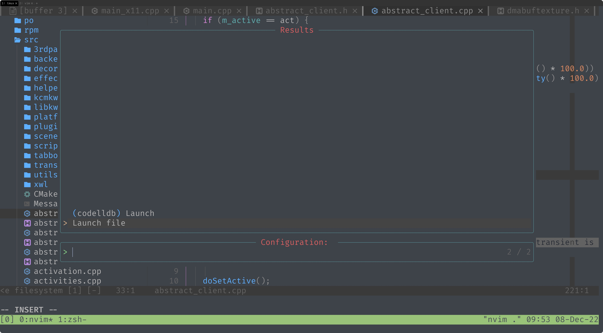
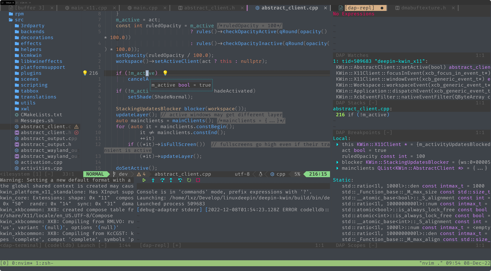
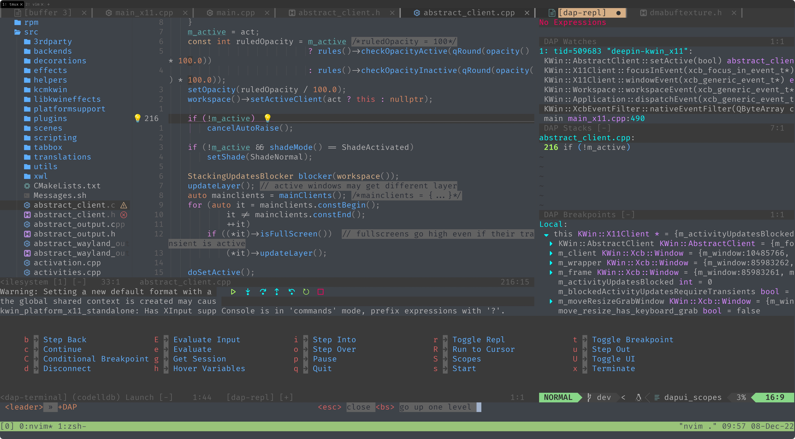
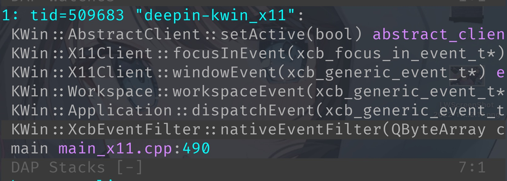
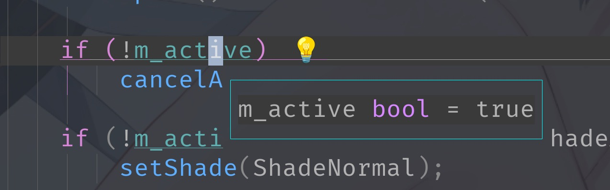
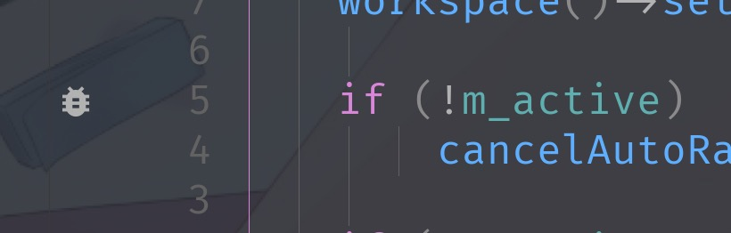
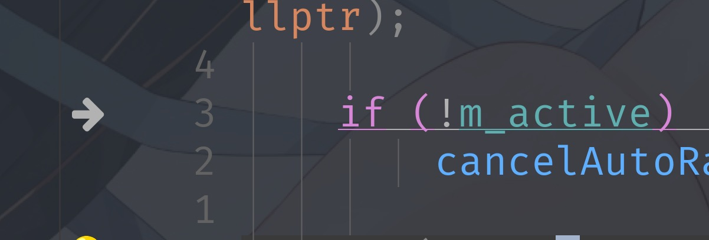

在之前我已经分享过了一份简单的 nvim 配置，它已经实现了编程所需的智能提示，语法高亮，代码跳转等功能，今天我打算整一下 nvim 的调试框架 dap。

dap 是一个框架，客户端负责在 nvim 上显示各种调试信息，比如显示断点、调用栈、对象内存信息等，服务端则提供客户端所需的功能，服务端通常是一个调试器，或者是调试器包装。

本篇会用到 Mason 这个插件去安装 dap 的服务端，本篇不会展开 Mason，将来有机会详细说一下。

首先先看几张正常工作的图:

<center>


运行界面



查看变量信息



快捷键



函数调用栈
</center>

## 安装 dap

在 Mason 的安装列表中添加上 codelldb，codelldb 是 vscode 用的调试服务端，负责给 vscode 提供调试信息，有了这个后端，我们就可以方便的实现和 vscode 相同的调试功能。

## 配置 dap

在 plugins 目录下新建 `_dap.lua` 文件。

```lua
return {
  "mfussenegger/nvim-dap",
  opt = true,
  module = { "dap" },
  requires = {
    {
      "theHamsta/nvim-dap-virtual-text",
      module = { "nvim-dap-virtual-text" },
    },
    {
      "rcarriga/nvim-dap-ui",
      module = { "dapui" },
    },
    "nvim-telescope/telescope-dap.nvim",
    {
      "jbyuki/one-small-step-for-vimkind",
      module = "osv",
    },
  },
  config = function()
    require("config.dap").setup()
  end,
  disable = false,
}
```

> 有些人会在 packer 里用 use 安装，把 return 改成 use 就可以了。

packer 的代码已经写好了，现在写 config 函数，在我的例子中，我把文件放在了 `lua/config/dap/` 目录下，因为要配置不同的语言，这样会方便管理一些。

首先要先在 dap 目录下新建一个 init.lua，这里是模块入口，初始化的工作从这里开始。

```lua
local M = {}

local function configure()
end

local function configure_exts()
end

local function configure_debuggers()
end

function M.setup()
	configure() -- Configuration
	configure_exts() -- Extensions
	configure_debuggers() -- Debugger
end

configure_debuggers()

return M
```

在 `_dap.lua` 中调用了 `require("config.dap").setup()`，这个 setup 函数就是 `config/dap/init.lua` 中的 `M.setup()` 函数。

目前只是写了一个壳子，现在让我们正式配置它吧。

### 快捷键

在 nvim 中进行调试，界面显然还是在终端里的，所以我们要使用快捷键进行一些操作，比如标记断点、单步进入、跳出等。

在 `config/dap/keymaps.lua` 中进行快捷键的配置。

```lua
local M = {}

local whichkey = require "which-key"
-- local legendary = require "legendary"

-- local function keymap(lhs, rhs, desc)
--   vim.keymap.set("n", lhs, rhs, { silent = true, desc = desc })
-- end

function M.setup()
  local keymap = {
    d = {
      name = "DAP",
      R = { "<cmd>lua require'dap'.run_to_cursor()<cr>", "Run to Cursor" },
      E = { "<cmd>lua require'dapui'.eval(vim.fn.input '[Expression] > ')<cr>", "Evaluate Input" },
      C = { "<cmd>lua require'dap'.set_breakpoint(vim.fn.input '[Condition] > ')<cr>", "Conditional Breakpoint" },
      U = { "<cmd>lua require'dapui'.toggle()<cr>", "Toggle UI" },
      b = { "<cmd>lua require'dap'.step_back()<cr>", "Step Back" },
      c = { "<cmd>lua require'dap'.continue()<cr>", "Continue" },
      d = { "<cmd>lua require'dap'.disconnect()<cr>", "Disconnect" },
      e = { "<cmd>lua require'dapui'.eval()<cr>", "Evaluate" },
      g = { "<cmd>lua require'dap'.session()<cr>", "Get Session" },
      h = { "<cmd>lua require'dap.ui.widgets'.hover()<cr>", "Hover Variables" },
      S = { "<cmd>lua require'dap.ui.widgets'.scopes()<cr>", "Scopes" },
      i = { "<cmd>lua require'dap'.step_into()<cr>", "Step Into" },
      o = { "<cmd>lua require'dap'.step_over()<cr>", "Step Over" },
      p = { "<cmd>lua require'dap'.pause.toggle()<cr>", "Pause" },
      q = { "<cmd>lua require'dap'.close()<cr>", "Quit" },
      r = { "<cmd>lua require'dap'.repl.toggle()<cr>", "Toggle Repl" },
      s = { "<cmd>lua require'dap'.continue()<cr>", "Start" },
      t = { "<cmd>lua require'dap'.toggle_breakpoint()<cr>", "Toggle Breakpoint" },
      x = { "<cmd>lua require'dap'.terminate()<cr>", "Terminate" },
      u = { "<cmd>lua require'dap'.step_out()<cr>", "Step Out" },
    },
  }
  local opts = {
    mode = "n",
    prefix = "<leader>",
    buffer = nil,
    silent = true,
    noremap = true,
    nowait = false,
  }
  whichkey.register(keymap, opts)
  --- require("legendary.integrations.which-key").bind_whichkey(keymap, opts, false)

  local keymap_v = {
    d = {
      name = "Debug",
      e = { "<cmd>lua require'dapui'.eval()<cr>", "Evaluate" },
    },
  }
  opts = {
    mode = "v",
    prefix = "<leader>",
    buffer = nil,
    silent = true,
    noremap = true,
    nowait = false,
  }
  whichkey.register(keymap_v, opts)
  --- require("legendary.integrations.which-key").bind_whichkey(keymap_v, opts, false)
end

return M
```

在这里我将快捷键绑定在了 `<leader> d` 上面。

现在返回到 `init.lua` 中，在 `setup` 函数中调用 keymaps。

```lua
function M.setup()
	require("config.dap.keymaps").setup() -- Keymaps
end
```

### dapui

dapui 是一个美化 dap 界面的插件，通常大家都会配置的吧！

```lua
local function configure_exts()
	require("nvim-dap-virtual-text").setup({
		commented = true,
	})

	local dap, dapui = require("dap"), require("dapui")
	dapui.setup({
		expand_lines = true,
		icons = { expanded = "", collapsed = "", circular = "" },
		mappings = {
			-- Use a table to apply multiple mappings
			expand = { "<CR>", "<2-LeftMouse>" },
			open = "o",
			remove = "d",
			edit = "e",
			repl = "r",
			toggle = "t",
		},
		layouts = {
			{
				elements = {
					{ id = "scopes", size = 0.33 },
					{ id = "breakpoints", size = 0.17 },
					{ id = "stacks", size = 0.25 },
					{ id = "watches", size = 0.25 },
				},
				size = 0.33,
				position = "right",
			},
			{
				elements = {
					{ id = "repl", size = 0.45 },
					{ id = "console", size = 0.55 },
				},
				size = 0.27,
				position = "bottom",
			},
		},
		floating = {
			max_height = 0.9,
			max_width = 0.5, -- Floats will be treated as percentage of your screen.
			border = vim.g.border_chars, -- Border style. Can be 'single', 'double' or 'rounded'
			mappings = {
				close = { "q", "<Esc>" },
			},
		},
	}) -- use default
	dap.listeners.after.event_initialized["dapui_config"] = function()
		dapui.open({})
	end
	dap.listeners.before.event_terminated["dapui_config"] = function()
		dapui.close({})
	end
	dap.listeners.before.event_exited["dapui_config"] = function()
		dapui.close({})
	end
end
```

配置基本上大家都没差多少，说不定都是从一个人的配置里搬运的。

<center>

</center>

### 配置 icon

我还修改了几个默认的 icon，在 configure 函数里。

```lua
local function configure()
	local dap_breakpoint = {
		breakpoint = {
			text = "",
			texthl = "LspDiagnosticsSignError",
			linehl = "",
			numhl = "",
		},
		rejected = {
			text = "",
			texthl = "LspDiagnosticsSignHint",
			linehl = "",
			numhl = "",
		},
		stopped = {
			text = "",
			texthl = "LspDiagnosticsSignInformation",
			linehl = "DiagnosticUnderlineInfo",
			numhl = "LspDiagnosticsSignInformation",
		},
	}

	vim.fn.sign_define("DapBreakpoint", dap_breakpoint.breakpoint)
	vim.fn.sign_define("DapStopped", dap_breakpoint.stopped)
	vim.fn.sign_define("DapBreakpointRejected", dap_breakpoint.rejected)
end
```
<center>



断点标记



单步停止
</center>

### 配置客户端

现在还差一个客户端的函数没有写，在这里只是为了调用针对不同语言设置的服务端，内容也非常的简单。

新建一个 `config/dap/cpp.lua`，在里面配置 c++ 相关的参数就行了，需要注意的是，codelldb 可以调试 c、c++、rust 等语言，就不会再拆分成更精细的文件了。

```lua
local M = {}

function M.setup()
	-- local dap_install = require "dap-install"
	-- dap_install.config("codelldb", {})

	local dap = require("dap")
	local install_root_dir = vim.fn.stdpath("data") .. "/mason"
	local extension_path = install_root_dir .. "/packages/codelldb/extension/"
	local codelldb_path = extension_path .. "adapter/codelldb"

	dap.adapters.codelldb = {
		type = "server",
		port = "${port}",
		executable = {
			command = codelldb_path,
			args = { "--port", "${port}" },

			-- On windows you may have to uncomment this:
			-- detached = false,
		},
	}
	dap.configurations.cpp = {
		{
			name = "Launch file",
			type = "codelldb",
			request = "launch",
			program = function()
				return vim.fn.input("Path to executable: ", vim.fn.getcwd() .. "/", "file")
			end,
			cwd = "${workspaceFolder}",
			stopOnEntry = true,
		},
	}

	dap.configurations.c = dap.configurations.cpp
	dap.configurations.rust = dap.configurations.cpp
end

return M
```

> Mason 在这里终于露面了，但是我们只是看到查找了 Mason 安装 codelldb 的路径而已。

配置的内容是固定的，设置一下执行文件的路径和参数，设置一下调试这个语言所需的启动参数，这里默认给了一个输入可执行文件路径启动调试的简单方法。

## 配置 launch.json

上面的内容就已经足够调试 c++ 程序了，但是 dap 还支持 vscode 的 launch.json，将启动配置作为固定模板填入启动调试的列表，并且在 launch.json 中我们还可以控制程序的环境变量，启动参数等，会比较方便一些。

dap 支持这个只需要在 setup 函数加上一行代码就足够了。

```lua
require("dap.ext.vscode").load_launchjs(nil, { codelldb = { "c", "cpp", "rust" } })
```

这句话的意思是 launch.json 中的类型是 codelldb 时，使用 c、cpp、rust 的调试配置，而上面我们配置了 codelldb 的参数 和 cpp 的参数，而且还将 cpp 的配置复制给了 c 和 rust。

但是有一个需要注意的地方，launch.json 现在环境变量换成了 environment 字段，并且结构也发生了变化，dap 目前只支持 env 字段，我在考虑贡献一个 pr 做一个自动转换。

这里给一个 launch.json 的例子：

```json
{
    "version": "0.2.0",
    "configurations": [
        {
            "name": "(codelldb) Launch",
            "type": "codelldb",
            "request": "launch",
            "program": "./build/bin/deepin-kwin_x11",
            "args": [
                "--replace"
            ],
            "stopAtEntry": true,
            "cwd": "${workspaceFolder}",
            "env": {
                "DISPLAY": ":0",
                "PATH": "${workspaceFolder}/build/bin:$PATH",
                "XDG_CURRENT_DESKTOP": "Deepin",
                "QT_PLUGIN_PATH": "${workspaceFolder}/build",
                "QT_LOGGING_RULES": "kwin_*.debug=true"
            },
            "externalConsole": false,
            "MIMode": "gdb",
            "setupCommands": [
                {
                    "description": "Enable pretty-printing for gdb",
                    "text": "-enable-pretty-printing",
                    "ignoreFailures": true
                }
            ]
        }
    ]
}
```

需要注意的是，这里的 codelldb 其实是一个标识字符串，vscode 默认提供的 type 是 cppgdb，我们也可以改成相同的字段。

想要在线查看最终文件内容，可以看下面几个链接：

[cpp.lua ](https://github.com/justforlxz/config.nvim/blob/master/lua/config/dap/rust.lua)
[init.lua](https://github.com/justforlxz/config.nvim/blob/master/lua/config/dap/init.lua)
[keymaps.lua](https://github.com/justforlxz/config.nvim/blob/master/lua/config/dap/keymaps.lua)
[\_dap.lua](https://github.com/justforlxz/config.nvim/blob/master/lua/plugins/_dap.lua)
