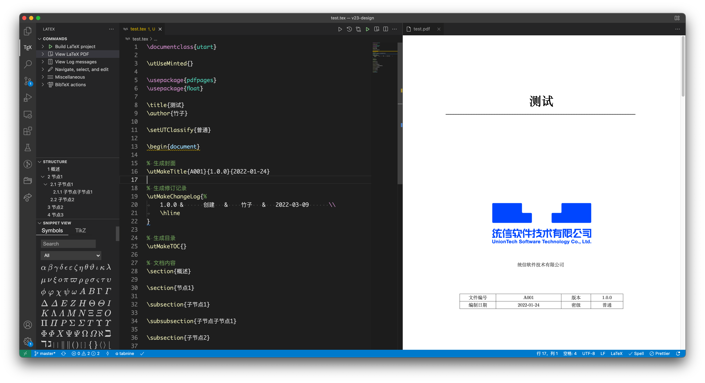
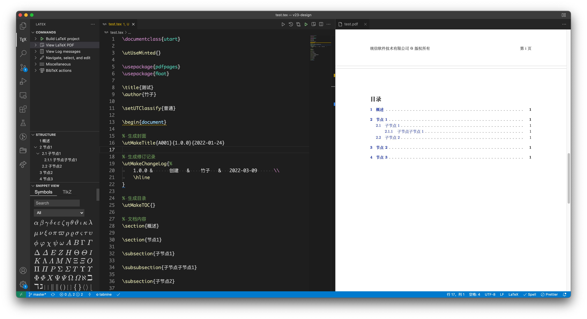

在我刚开始学习使用 Linux 的时候，经常能看到一些人在鼓吹 tex、markdown、org-mode 之类的文档编写方式的好处，甚至分化出不同的阵营，互相拉拢（~~忽悠~~）其他刚入门的人。

后来我渐渐喜欢上了 markdown，因为它写起来足够简单，上手难度较低，而且我的博客是用 hexo 搭建的，它需要 markdown 作为博客文章，所以我逐渐就使用起来了 markdown。

在公司里，虽然 markdown 写起来非常简单，但是公司内部的文档是有格式要求的，排版被提上了日程，而排版恰恰是 markdown 的硬伤，markdown 可以说几乎没有排版的功能，它是轻量的标记语言，没有人给它提供复杂的排版，所以我们的目标变成了需要一种方便进行文本 diff 又不是 word 这类软件，最终我们的目标落在了 latex 上。

在 20 世纪，计算机教授高德纳（Donald Ervin Knuth）编写了一个排版软件，它可以处理非常复杂的数学公式，后来发展出了非常多的语言排版，它在学术界特别是数学、物理学和计算机科学界十分流行。tex 被普遍认为是一个优秀的排版工具，尤其是对于复杂数学公式的处理。利用 latex 等终端软件，tex 就能够排版出精美的文本以帮助人们辨认和查找。

latex 是一种基于 tex 的排版系统，利用这种格式系统的处理，即使用户没有排版和程序设计的知识也可以充分发挥由 tex 所提供的强大功能，不必一一亲自去设计或校对，能在几天，甚至几小时内生成很多具有书籍质量的印刷品。

目前来看，我们使用 latex 写文档，进行 git 提交，在使用的时候编译成 pdf，发送给其他人使用，其他人更新文档我们也可以非常方便进行 review。

所以我就需要在本地配置一下 latex 的环境，以及使用 vscode 进行 latex 文档的编写。

## 安装

由于我在使用 macOS，所以我需要进行的步骤要比使用 deepin 多一些。

在 deepin 上，只需要安装 texlive-lang-cjk 和 texlive-xetex 两个包就可以了。

```shell
sudo apt install texlive-lang-cjk texlive-xetex
```

在 macOS 上，需要使用 homebrew 安装 mactex，这是专门针对 mac 系统优化的 tex 发行版。

```shell
brew install mactex
```

安装完 mactex 以后，需要打开 TeX Live Utility，然后选择更新，将所有包更新到最新。如果觉得网速慢，可以使用国内的镜像加速下载。

阅读 [https://mirrors.bfsu.edu.cn/help/CTAN/](https://mirrors.bfsu.edu.cn/help/CTAN/) 使用镜像。

以上安装工作就结束了。

## 配置模板

为了方便每个人写的文档都满足公司的要求，所以我们准备了一份公司的 latex 模板，latex 的模板规定了一些目录，只要放在模板目录即可使用。

Linux: `/usr/share/texlive/texmf-dist/tex/latex/`

macOS: `~/Library/texmf/tex/latex/`

## vscode

以上准备工作做好以后，打开 vscode，安装 `LaTeX Workshop` 插件，其他插件可以不用安装，这个插件会帮助我们自动补全语法、高亮和格式化。

准备完毕以后，就可以愉快写 latex 了，本篇文章并不会教大家如何写 latex，只是介绍一下 latex，以及我使用的配置。

首先给 vscode 配置以下的工作区配置:

```json
{
    "latex-workshop.latex.outDir": "%DIR%/build",
    "latex-workshop.view.pdf.viewer": "tab",
    "latex-workshop.latex.autoBuild.cleanAndRetry.enabled": true,
    "latex-workshop.latex.autoClean.run": "onFailed",
    "latex-workshop.latex.clean.subfolder.enabled": true,
    "latex-workshop.latex.clean.fileTypes": [ "*.aux" ],
    "latex-workshop.latex.tools": [
        {
            "name": "xelatex",
            "command": "xelatex",
            "args": [
                "-synctex=1",
                "-interaction=nonstopmode",
                "-file-line-error",
                "--shell-escape",
                "-pdf",
                "--output-directory=%OUTDIR%",
                "%DOCFILE%"
            ]
        },
        {
            "name": "pdflatex",
            "command": "pdflatex",
            "args": [
                "-synctex=1",
                "-interaction=nonstopmode",
                "-file-line-error",
                "--output-directory=%OUTDIR%",
                "%DOCFILE%"
            ]
        },
        {
            "name": "bibtex",
            "command": "bibtex",
            "args": [
                "%OUTDIR%/%DOCFILE%"
            ],
            "env": {
                "TEXMFOUTPUT": "%OUTDIR%"
            }
        }
    ],
    "latex-workshop.latex.recipes": [
        {
            "name": "xelatex",
            "tools": [
                "xelatex"
            ],
        },
        {
            "name": "pdflatex",
            "tools": [
                "pdflatex"
            ]
        },
        {
            "name": "xe->bib->xe->xe",
            "tools": [
                "xelatex",
                "bibtex",
                "xelatex",
                "xelatex"
            ]
        },
        {
            "name": "pdf->bib->pdf->pdf",
            "tools": [
                "pdflatex",
                "bibtex",
                "pdflatex",
                "pdflatex"
            ]
        }
    ],
}
```

在配置中，这段的作用是控制输出目录、自动构建和清理。

```json
{
    "latex-workshop.latex.outDir": "%DIR%/build",
    "latex-workshop.view.pdf.viewer": "tab",
    "latex-workshop.latex.autoBuild.cleanAndRetry.enabled": true,
    "latex-workshop.latex.autoClean.run": "onFailed",
    "latex-workshop.latex.clean.subfolder.enabled": true,
    "latex-workshop.latex.clean.fileTypes": [ "*.aux" ],
}
```

接下来的步骤是控制编译的，为什么需要写这么长呢，因为 latex 其实不支持中文的，支持中文的是 xelatex，我们需要重写编译参数，否则输出的 pdf 是不会显示中文的。

在 `latex-workshop.latex.tools` 中，我们增加了三个新的构建指令，用于处理我们的 latex 文档。

在 `latex-workshop.latex.recipes` 中，第一个 recipe 为默认的编译工具，所以默认我们会使用 xelatex 进行编译，从而使用我们自定义的编译命令。

保存工作区配置到 `.vscode/settings.json` 中，就可以愉快的写 latex 啦。

放几张演示图片：




