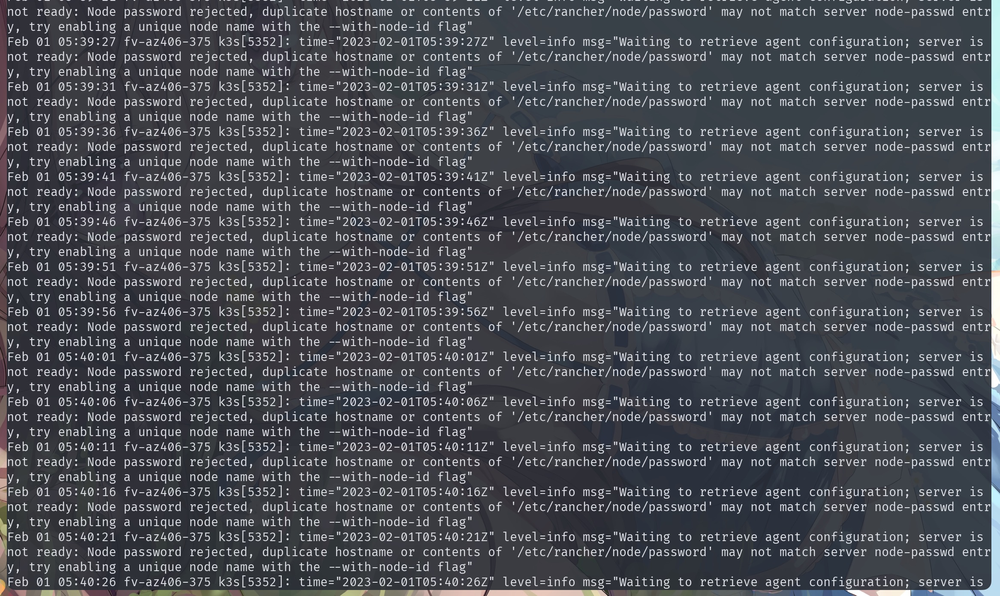

```text
Feb 01 05:40:37 fv-az406-375 k3s[5352]: time="2023-02-01T05:40:37Z" level=info msg="Waiting to retrieve agent configuration; server is not ready: Node password rejected, duplicate hostname or contents of '/etc/rancher/node/password' may not match server node-passwd entry, try enabling a unique node name with the --with-node-id flag"
```

When you join a cluster, you are reminded that it already exists, but the same node does not exist in the cluster.

you can do this.

```
kubectl -n kube-system delete secrets <node name>.node-password.k3s
```

example:

first, we list all node to check, if the node exists, we should not continue the operation, we need to modify the name of the node that is joining the cluster to avoid conflicts with existing ones.

```shell
kubectl get node
```

```text
rpi4                    Ready    control-plane,master   2d3h   v1.25.6+k3s1
```

Now the homenas-vm node does not exist. But the logs tell us that the cluster already has the password, it doesn't match the current one.

Then we need to manually delete the old password in the cluster and let the new node join.

you can use this command to show all secrets, the node password in here.

```
kubectl get -n kube-system secrets
```

then you will see all secrets.

```
NAME                                      TYPE                 DATA   AGE
company-laptop.node-password.k3s          Opaque               1      2d1h
company-pc.node-password.k3s              Opaque               1      2d2h
homenas-vm.node-password.k3s              Opaque               1      50m
k3s-serving                               kubernetes.io/tls    2      2d3h
rpi4.node-password.k3s                    Opaque               1      2d3h
sh.helm.release.v1.traefik-crd.v1         helm.sh/release.v1   1      2d3h
sh.helm.release.v1.traefik.v1             helm.sh/release.v1   1      2d3h
```

if the homenas-vm is invalid, we need to delete it manually.

```
kubectl -n kube-system delete secrets homenas-vm.node-password.k3s
```

it's done!
