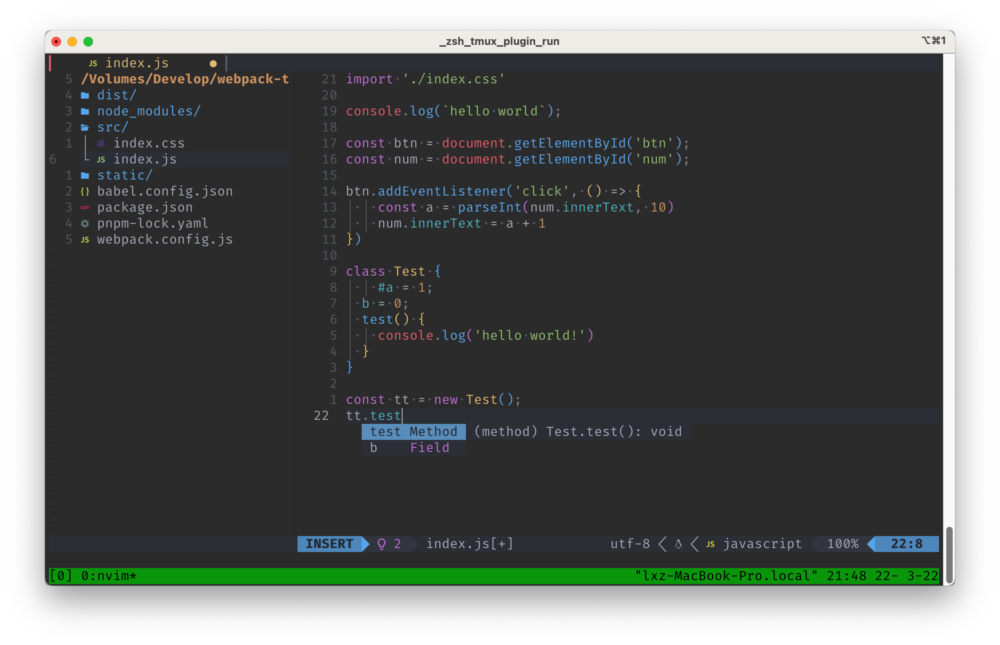
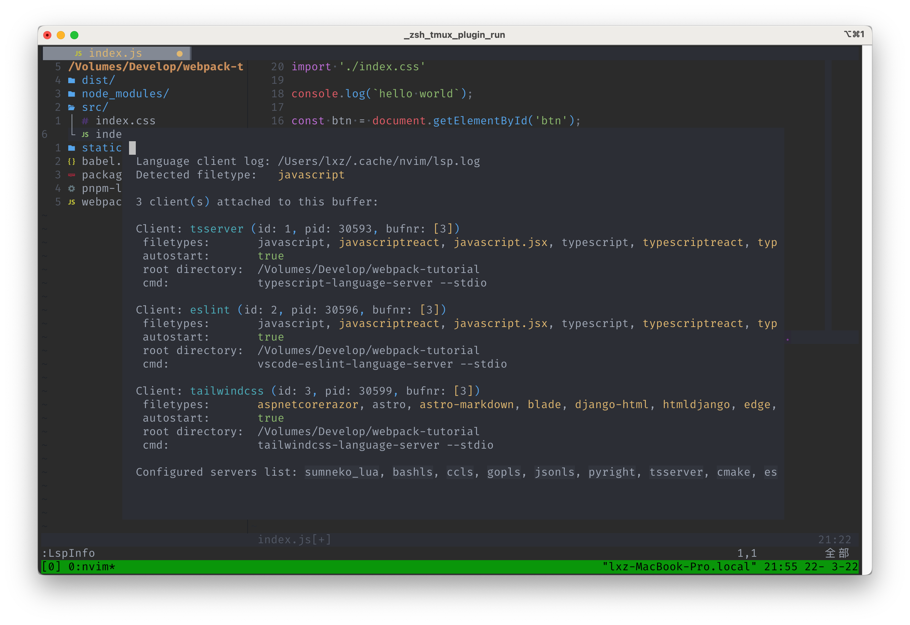
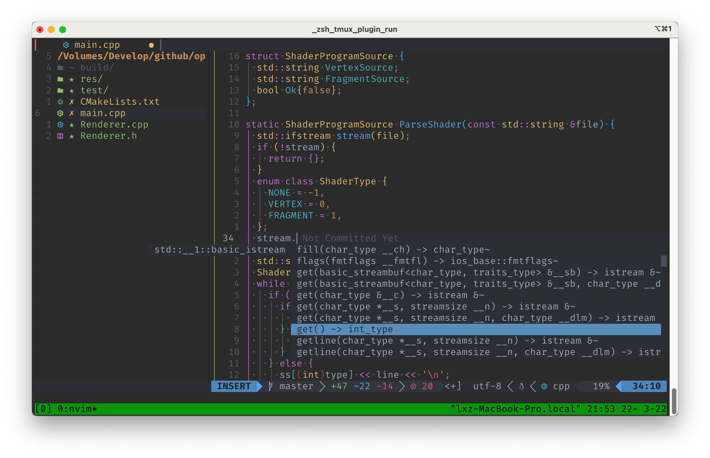
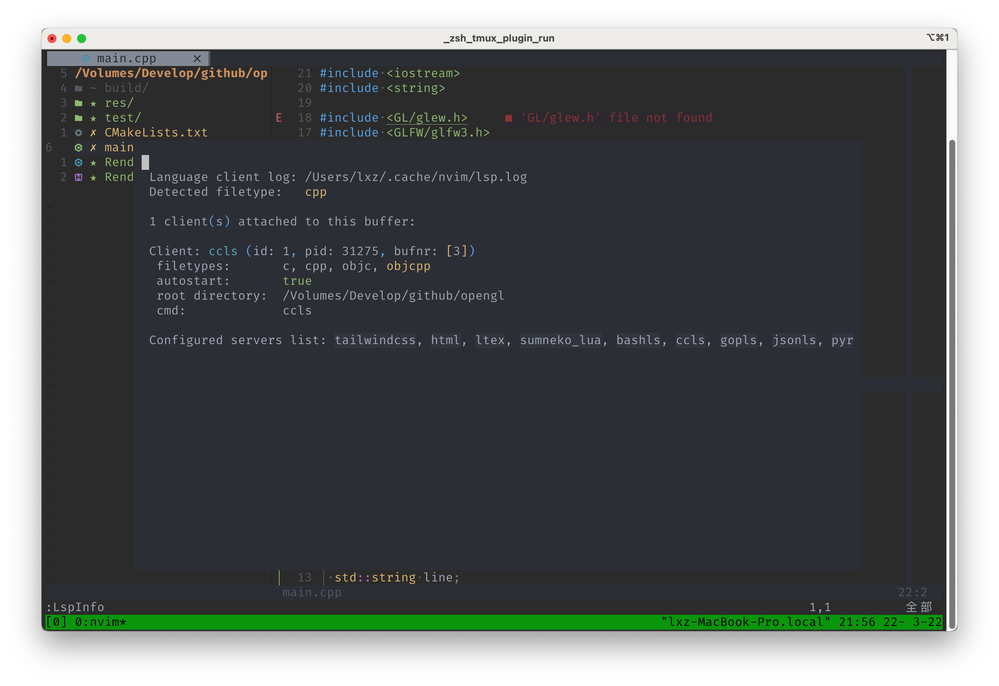

作为一个爱折腾的同学，折腾几个编辑器不过分吧。

我折腾编辑器的历史还算跟得上潮流，最开始用 sublime，后来 atom 出来了，吊打 sublime，我就去用 atom了。
再后来宇宙第一编辑器 vscode 出来了，吊打了(我认为)所有的编辑器，我就又去用 vscode。 ~~(怎么感觉我一直在追新?喵?)~~

工作以后，坐我左边的是一个 emacs 用户，右边是一个 vim 用户，然后他俩偶尔会拉我看他们搞的新插件，或者是他们互相在自己的编辑器上实现了对方的插件的功能。
说实话我也不是没用过 vim 或者 emacs，但是最大的问题其实是，对我来说学习成本非常大，遇到一点小问题，我就会不由自主的回想起 vscode 的好，然后就不想折腾了。
这对我其实是不好的，毕竟我是一个爱折腾的人。

所以我又一次折腾起了 emacs，每一次折腾都会让我学习到新的内容，从最开始的懵逼，到现在已经会简单的用 lisp 写一些插件。每一次都有提升，不过就是无用功比较多。

但是本篇先不折腾 emacs，这次我想先写一下我学习到的 vim 的配置。

## neovim

vim 阵营其实可以简单的分为 vim 和 neovim，为什么会有两个阵营呢？简单来说就是 neovim 的作者受不了 vim 的作者，所以 fork 出来增加自己的功能，结果从原版那里拉来了很多的用户，
vim 作者一看阵势不对，赶紧又反向增加功能，现在两者的区别已经不是很大了。

使用 neovim 作为我的主 vim 编辑器是因为它支持 lua 脚本作为配置文件，lua 脚本比较好上手一些。

## 基本配置

neovim 的配置文件在 `~/.config/nvim/`。

入口文件是 `init.vim`，里面写的内容很简单，就是加载 lua 脚本。

```lua
" 基础设置
lua require('basic')
```

需要注意的是，lua 脚本必须都放在 init.vim 同级的 lua 目录里。

我使用 packer 作为 vim 的插件管理系统，vim 有很多插件系统，我选择它没有啥理由，就是随手用了一个。

安装 picker 需要手动下载，但是这样可能会在更换环境的时候忘记，所以我写在了脚本里，检测并自动下载。

在 `~/.config/nvim/lua/basic.lua` 里就可以写 lua 脚本去执行更复杂的指令，比如加载插件。

```lua
-- utf8
-- 高亮所在行
vim.wo.cursorline = true
-- 右侧参考线，超过表示代码太长了，考虑换行
vim.wo.colorcolumn = "80"
-- 缩进2个空格等于一个Tab
vim.o.tabstop = 2

local fn = vim.fn
-- 下载 packer
local install_path = fn.stdpath('data')..'/site/pack/packer/start/packer.nvim'
local is_startup = false
if fn.empty(fn.glob(install_path)) > 0 then
  fn.system({'git', 'clone', '--depth', '1', 'https://github.com/wbthomason/packer.nvim', install_path})
  vim.cmd[[packadd packer.nvim]]
  is_startup = true
end

-- 初始化 packer
return require('packer').startup(
  function()
    local use = require('packer').use
    local home = os.getenv("HOME")
    -- 使用 ~/.config/nvim/lua/plugins-d 作为插件的目录
    local plugins = io.popen('find "'.. home .. '/.config/nvim/lua/plugins-d/'..'" -type f')
    for plugin in plugins:lines() do
      -- 插件的标准文件名是这种形式 _lsp.lua
      local part1, part2 = string.match(plugin,home .. "/[.]config/nvim/lua/(.*)_(.*)[.]lua")
      if part1 ~= nil and part2 ~= nil then
        plugin = part1 .. '_' .. part2
      else
        plugin = ''
      end
      if plugin ~= '' then
        use(require(plugin))
      end
    end
    if is_startup then
      require('packer').sync()
    end
  end
)
```

新建一个 plugins-d 目录，就可以写插件了，使用 vim 作为开发工具，第一件事肯定是先配置好语言服务器。

新建 `~/.config/nvim/lua/plugins-d/_lsp.lua`
```lua
-- https://github.com/neovim/nvim-lspconfig

-- Description:
-- lsp configs for neovim builtin lsp

Capabilities = vim.lsp.protocol.make_client_capabilities()

-- Use an on_attach function to only map the following keys
-- after the language server attaches to the current buffer
On_Attach_hooks = {}
function On_Attach (client, bufnr)
  local wk = require("which-key")
  local key_opts = {
    -- mode   Help        Affected                              Equivalent
    -- ''     mapmode-nvo Normal/Visual/Select/Operator-pending :map
    -- 'n'    mapmode-n	  Normal                                :nmap
    -- 'v'    mapmode-v   Visual/Select                         :vmap
    -- 's'    mapmode-s	  Select                                :smap
    -- 'x'    mapmode-x	  Visual                                :xmap
    -- 'o'    mapmode-o   Operator-pending                      :omap
    -- '!'    mapmode-ic  Insert/Command-line                   :map!
    -- 'i'    mapmode-i   Insert                                :imap
    -- 'l'    mapmode-l   Insert/Command-line/Lang-Arg          :lmap
    -- 'c'    mapmode-c   Command-line                          :cmap
    -- 't'    mapmode-t   Terminal                              :tmap
    mode    = "n",
    buffer  = 0, -- local mappings
    silent  = true, -- use `silent ` when creating keymaps
    noremap = true, -- use `noremap` when creating keymaps
  }

  wk.register(
    {
      ["K"] = {
        "<cmd>lua vim.lsp.buf.hover()<CR>",
        "LSP:: hover" },
      ["<C-k>"] = {
        "<cmd>lua vim.lsp.buf.signature_help()<CR>",
        "LSP:: signature help" },
      ["<space>rn"] = {
        "<cmd>lua vim.lsp.buf.rename()<CR>",
        "LSP:: rename" },
      ["<space>f"] = {
        "<cmd>lua vim.lsp.buf.formatting()<CR>",
        "LSP:: format" },
      ["<space>E"] = {
        "<cmd>lua vim.diagnostic.open_float()<CR>",
        "LSP:: float diagnostic" },
    },
    key_opts
  )

  key_opts = {
    mode    = "n",
    buffer  = 0, -- local mappings
    silent  = true, -- use `silent ` when creating keymaps
    noremap = false, -- not use `noremap` when creating keymaps
  }

  wk.register(
    {
      ["gd"] = {
        "<cmd>lua vim.lsp.buf.definition()<cr>",
        "LSP:: definition" },
      ["gr"] = {
        "<cmd>lua vim.lsp.buf.references()<cr>",
        "LSP:: reference" },
      ["gi"] = {
        "<cmd>lua vim.lsp.buf.implementation()<cr>",
        "LSP:: implementation" },
      ["gy"] = {
        "<cmd>lua vim.lsp.buf.type_definition()<cr>",
        "LSP:: type definition" },
    },
    key_opts
  )

  for _, hook in ipairs(On_Attach_hooks) do
    if hook ~= nil then
      hook(client, bufnr)
    end
  end
end

local function config()
  local nvim_lsp = require('lspconfig')

  -- Use a loop to conveniently call 'setup' on multiple servers and
  -- map buffer local keybindings when the language server attaches
  local servers ={
    'ccls',
  }

  for _, lsp in ipairs(servers) do
    local default = {
      flags = {
        debounce_text_changes = 150,
      },
      on_attach = On_Attach,
      capabilities = Capabilities
    }

    local cfg = vim.tbl_deep_extend('force', default, require('lsp-d/'..lsp..'_'))
    nvim_lsp[lsp].setup(cfg)
  end
end

return {
  'neovim/nvim-lspconfig',
  config = config,
  after = {
    'nvim-cmp',
  }
}
```

不要看文件很长，其实大部分都是 nvim 的默认 lsp-config 配置，而且大部分配置一眼就能看得懂，最开始 On_Attach 函数是在处理快捷键相关的，即使不了解 vim 如何定义快捷键，也不影响看这个配置文件。

在 config 函数中，有一个数组，包含了 ccls，这里的意思是去加载 ccls 语言服务器，nvim 给了一分列表，可以查找自己使用的[语言服务器](https://github.com/neovim/nvim-lspconfig/blob/master/doc/server_configurations.md)的名称。

在 config 函数里，local cfg 这里是定义查找文件的，我这里是听从了 [black_desk](https://github.com/black_desk) 的建议，如果文件名是 _ 开头的，就屏蔽这个文件，可以快速进行调试。

在 `~/.config/nvim/lua/lsp-d/ccls_.lua` 里写入配置内容，就可以启用 ccls 语言服务器了。

```lua
local home = os.getenv('HOME')
return {
  init_options = {
    cache = {
      directory = home .. "/.ccls-cache",
      retainInMemory = 0,
    },
    -- highlight = {
      -- lsRanges = true,
    -- }
  };
}
```

默认 nvim 是定义了很多值，并不是每一个语言服务器都需要定义，但是需要注意的是，即使没有使用配置文件，也需要创建相应的文件，并返回一个空对象。

基本配置已经完成了，只差最后一步了，还记得一开始我说的使用了 packer 作为插件管理器了么，现在就需要编译一遍配置文件，让 packer 能加载我们的插件。

执行命令 `nvim +PackerCompile`，然后退出 vim。如果改动了配置文件，都需要重新执行一次这样的命令，否则配置将不会生效。

下面是我的使用截图。








